## Docker & container summary 


### Docker engine configuration on LInux 

### case 1


### case 2 


### Restart policy in docker engine for container 


### restart policy for containers 


### checking restart policy of any container 

```
docker  inspect  ashuc1  --format='{{.HostConfig.RestartPolicy.Name}}'
no

```

### setting restart policy during container creation time 

```
docker  run -itd --name ashuc2  --restart on-failure  c5f49a140b13  
ee0dee145bf83eed8ed891f70fcbee2e118d53ced780db97d157e127813cdf6e
```

###  Cgroups in Container 


### checking resources inside contaienr 

```
 362  docker  stats ashuc1
  363  docker  exec -itd  ashuc1  ping fb.com 
  364  docker  stats ashuc1
  365  docker  exec -itd  ashuc1  sleep 100 
  366  docker  stats ashuc1
  367  history 
[ashu@ip-172-31-17-159 oracledockerimages]$ docker  top  ashuc1
UID                 PID                 PPID                C                   STIME               TTY                 TIME                CMD
root                9545                9503                0                   04:35               pts/0               00:00:00            python3 /mycode/ashu.py
root                14480               9503                0                   04:48               pts/1               00:00:00            ping fb.com
root                14883               9503                0                   04:48               pts/2               00:00:00            sleep 100

```

### putting hardware limit to containers 

```
372  docker  run -itd --name ashuc3  --restart always --memory 100m   c5f49a140b13
  373  docker  run -itd --name ashuc4  --restart always --memory 100m  --cpu-shares=20  c5f49a140b13
  
```

## remove all data of docker engine 

```
 378  docker  rm $(docker ps -aq) -f
  379  docker rmi $(docker  images -q) -f
  380  history 
  381  docker  images 
  382  docker  ps -a
  383  docker network prune 
  384  docker volume rm $(docker  volume ls -q)
  
```

### Docker volume more details 


### deploy mysql db container 


### db container 

```
docker  run -itd --name ashudbc1 -e MYSQL_ROOT_PASSWORD=oracleTr088  -v /home/ashu/oracledockerimages/dbdata:/var/lib/mysql/     mysql

```

### check logs of db container 

```
 docker logs -f ashudbc1
2021-11-10 05:41:02+00:00 [Note] [Entrypoint]: Entrypoint script for MySQL Server 8.0.27-1debian10 started.
2021-11-10 05:41:02+00:00 [Note] [Entrypoint]: Switching to dedicated user 'mysql'
2021-11-10 05:41:02+00:00 [Note] [Entrypoint]: Entrypoint script for MySQL Server 8.0.27-1debian10 started.
2021-11-10 05:41:03+00:00 [Note] [Entrypoint]: Initializing database files
2021-11-10T05:41:03.066775Z 0 [System] [MY-013169] [Server] /usr/sbin/mysqld (m

21-11-10T05:41:30.741348Z 0 [System] [MY-010931] [Server] /usr/sbin/mysqld: ready for connections. Version: '8.0.27'  socket: '/var/run/mysqld/mysqld.sock'  port: 3306  MySQL Community Server - GPL.
^C

```

### checking details of db container 

```
docker  exec -it  ashudbc1  bash 
root@6e6d000e8f5a:/# 
root@6e6d000e8f5a:/# cat  /etc/os-release 
PRETTY_NAME="Debian GNU/Linux 10 (buster)"
NAME="Debian GNU/Linux"
VERSION_ID="10"
VERSION="10 (buster)"
VERSION_CODENAME=buster
ID=debian
HOME_URL="https://www.debian.org/"
SUPPORT_URL="https://www.debian.org/support"
BUG_REPORT_URL="https://bugs.debian.org/"

```

### connecting to db server 

```
root@6e6d000e8f5a:/# mysql -u root -p 
Enter password: 
Welcome to the MySQL monitor.  Commands end with ; or \g.
Your MySQL connection id is 8
Server version: 8.0.27 MySQL Community Server - GPL

Copyright (c) 2000, 2021, Oracle and/or its affiliates.

Oracle is a registered trademark of Oracle Corporation and/or its
affiliates. Other names may be trademarks of their respective
owners.

Type 'help;' or '\h' for help. Type '\c' to clear the current input statement.

mysql> show databases;
+--------------------+
| Database           |
+--------------------+
| information_schema |
| mysql              |
| performance_schema |
| sys                |
+--------------------+
4 rows in set (0.01 sec)

```

### docker webuI using portainer 

```
docker  run -itd  --restart  always  -p 9000:9000 -v  /var/run/docker.sock:/var/run/docker.sock  portainer/portainer 
Unable to find image 'portainer/portainer:latest' locally
latest: Pulling from portainer/portainer
94cfa856b2b1: Pull complete 
49d59ee0881a: Pull complete 
a2300fd28637: Pull complete 

```

### Docker compose Introduction 


### Install docker compose 

[Link](https://docs.docker.com/compose/install/)

## snap 

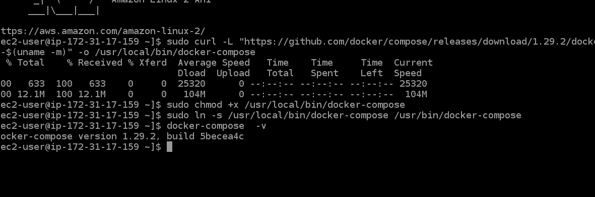

### checking compose 

```
docker-compose  -v
docker-compose version 1.29.2, build 5becea4c
[ashu@ip-172-31-17-159 oracledockerimages]$ docker-compose  version 
docker-compose version 1.29.2, build 5becea4c
docker-py version: 5.0.0
CPython version: 3.7.10
OpenSSL version: OpenSSL 1.1.0l  10 Sep 2019

```

### compsoe file info 

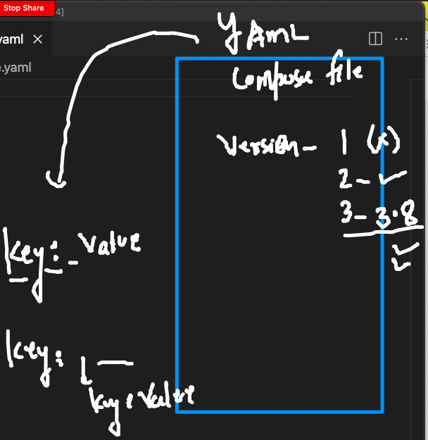

### Example 1. 

```
version: '3.8' # compsoe file version 
services: # for container apps 
 ashuapp1: # name of application 
  image: alpine
  container_name: ashuc1
  command: ping localhost # parent process
  restart: always # restart policy 

```

### deploy 

```
 cd  ashutoshhcompose/
[ashu@ip-172-31-17-159 ashutoshhcompose]$ ls
docker-compose.yaml
[ashu@ip-172-31-17-159 ashutoshhcompose]$ docker-compose up -d 
Creating network "ashutoshhcompose_default" with the default driver
Creating ashuc1 ... done
[ashu@ip-172-31-17-159 ashutoshhcompose]$ docker-compose  ps
 Name       Command       State   Ports
---------------------------------------
ashuc1   ping localhost   Up           
[ashu@ip-172-31-17-159 ashutoshhcompose]$ 

```

### compose more commands 

```
[ashu@ip-172-31-17-159 ashutoshhcompose]$ ls
docker-compose.yaml
[ashu@ip-172-31-17-159 ashutoshhcompose]$ docker-compose  ps
 Name       Command       State   Ports
---------------------------------------
ashuc1   ping localhost   Up           
[ashu@ip-172-31-17-159 ashutoshhcompose]$ docker-compose  stop
Stopping ashuc1 ... done
[ashu@ip-172-31-17-159 ashutoshhcompose]$ docker-compose  ps
 Name       Command        State     Ports
------------------------------------------
ashuc1   ping localhost   Exit 137        
[ashu@ip-172-31-17-159 ashutoshhcompose]$ docker-compose  start
Starting ashuapp1 ... done
[ashu@ip-172-31-17-159 ashutoshhcompose]$ docker-compose  kill
Killing ashuc1 ... done
[ashu@ip-172-31-17-159 ashutoshhcompose]$ docker-compose  rm 
Going to remove ashuc1
Are you sure? [yN] y
Removing ashuc1 ... done
[ashu@ip-172-31-17-159 ashutoshhcompose]$ docker-compose  up -d
Creating ashuc1 ... done
[ashu@ip-172-31-17-159 ashutoshhcompose]$ docker-compose  ps
 Name       Command       State   Ports
---------------------------------------
ashuc1   ping localhost   Up    

```

### for complete removal 

```
docker-compose  down 
Stopping ashuc1 ... done
Removing ashuc1 ... done
Removing network ashutoshhcompose_default

```

### example 2 

```
version: '3.8' # compsoe file version 
services: # for container apps 
 ashudbapp: # db container app 
  image: mysql 
  container_name: ashudbc1 
  restart: always 
  environment:
   MYSQL_ROOT_PASSWORD: "oracleTr088#" 
 ashuapp2: # second app 
  image: dockerashu/oraclejava:v1 
  container_name: ashuc2 
  ports: # port forwarding 
   - 3344:8080 
  restart: always 
 ashuapp1: # name of application 
  image: alpine
  container_name: ashuc1
  command: ping localhost # parent process
  restart: always # restart policy 

```


### deploy 

```
 docker-compose -f multicont.yaml up -d 
Creating network "ashutoshhcompose_default" with the default driver
Pulling ashuapp2 (dockerashu/oraclejava:v1)...
v1: Pulling from dockerashu/oraclejava
a4df6f21af84: Extracting [================================>                  ]  57.93MB/90.3a4df6f21af84: Extracting [================================>                  ]  59.05MB/90.3a4df6f21af84: Extracting [================================>                  ]   59.6MB/90.3a4df6f21af84: Extracting [=================================>                 ]  60.72MB/90.3a4df6f21af84: Extracting [==================================>                ]  62.39MB/90.3a4df6f21af84: Pull complete05a782d6950e: Pull completeff12b7ec20b9: Pull completeDigest: sha256:f6df93895957d5302d8ac19bdd904a28e14d01a3f5e0f8869daddc6a39fe0108
Status: Image is up to date for dockerashu/oraclejava:v1
Creating ashuc1   ... done
Creating ashuc2   ... done
Creating ashudbc1 ... done
```

### few more compose operations 

```
 460  docker-compose -f multicont.yaml  stop 
  461  docker-compose -f multicont.yaml  ps
  462  docker-compose -f multicont.yaml  start   ashuapp1
  463  docker-compose -f multicont.yaml  ps
  464  docker-compose -f multicont.yaml  kill  ashuapp1
  465  docker-compose -f multicont.yaml  start
  466  docker-compose -f multicont.yaml  ps
  467  docker-compose -f multicont.yaml  stop  ashuapp1 
  468  docker-compose -f multicont.yaml  ps
  
 ```
 
 ### example 3 
 
 ```
 version: '3.8'
networks: # to create network bridge 
 ashubr1: # name of bridge 
volumes: # to create volume 
 ashudbvol1:  # name of volume 
services:
 ashudbapp: # name of service 
  image: mysql
  container_name: ashudbc111 
  restart: always 
  environment: 
   MYSQL_ROOT_PASSWORD: "Hellodbc1##"
  volumes: # to mount volume created above 
   - "ashudbvol1:/var/lib/mysql/"
  networks: # to use above created network 
   - ashubr1  
 
 ```
 
 ### demo deploy 
 
 ```
  docker-compose -f db.yaml up -d  
Creating network "ashutoshhcompose_ashubr1" with the default driver
Creating volume "ashutoshhcompose_ashudbvol1" with default driver
Creating ashudbc111 ... done
[ashu@ip-172-31-17-159 ashutoshhcompose]$ docker-compose -f db.yaml  ps
   Name                Command             State          Ports       
----------------------------------------------------------------------
ashudbc111   docker-entrypoint.sh mysqld   Up      3306/tcp, 33060/tcp
[ashu@ip-172-31-17-159 ashutoshhcompose]$ 
 
 ```
 
### Container with build image 


### example 4 

```
version: '3.8'
services:
 ashuwebapp: 
  image: dockerashu/webapp:v111 
  build:  # calling dockerfile from current location 
   context: . # location of dockerfile 
   dockerfile: httpd.dockerfile  # name of dockerfile 
  container_name: ashuwebc1
  ports:
   - 6644:80 
  restart: always 

```


# demo 
```
docker-compose up --build -d 
Building ashuwebapp
Sending build context to Docker daemon  1.005MB
Step 1/6 : FROm oraclelinux:8.4
 ---> 97e22ab49eea
Step 2/6 : LABEL name=ashutoshh
 ---> Using cache
 ---> 1710c35a393b
Step 3/6 : RUN yum install httpd -y
 ---> Using cache
 ---> 05741b493c7f
Step 4/6 : COPY .  /var/www/html/
 ---> 36a374199ae8
Step 5/6 : EXPOSE 80
 ---> Running in 64a7d301043a
Removing intermediate container 64a7d301043a
 ---> 3339e865c7da
Step 6/6 : ENTRYPOINT httpd -DFOREGROUND
 ---> Running in 9e2b4116dbf4
 
 ```
 
 ### compose file link git repo 
 
 [ashutoshh] (https://github.com/redashu/docker-compose)
 
 
 ### problem with docker engine incase of app deployment in prod env 
 
 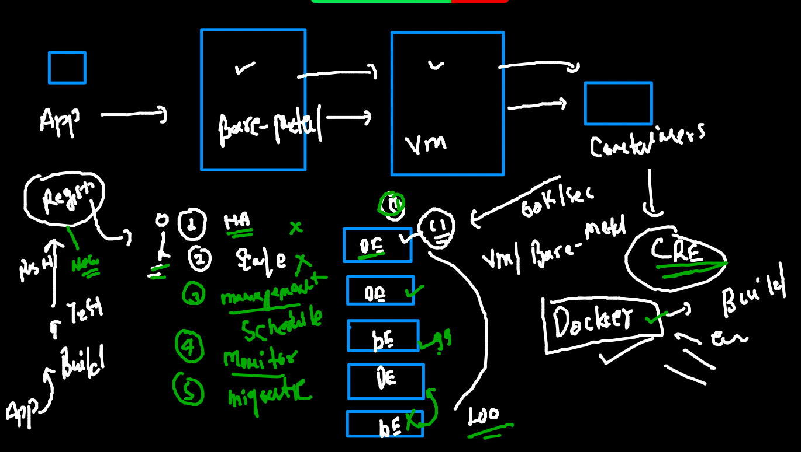
 
 ## COntainer management or container orchestration engine or tools 
 
 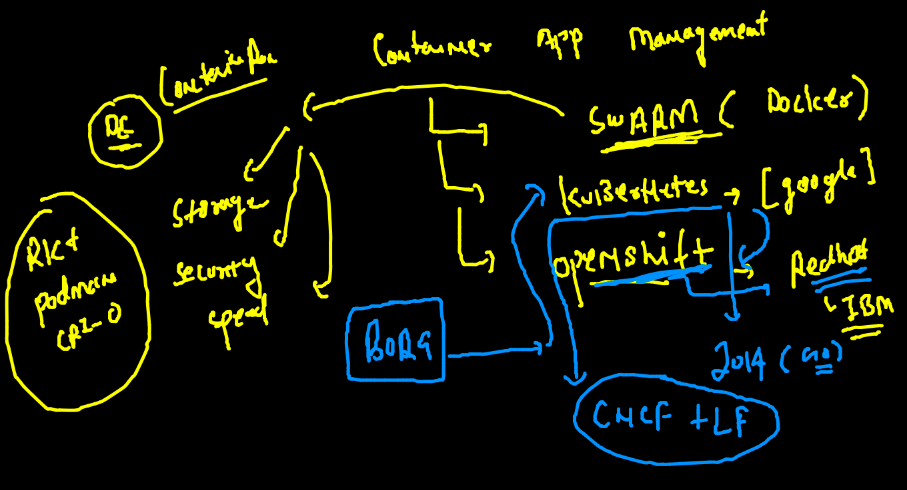
 
 ## Understanding k8s arch  
 
 ### LEvel 1 
 
 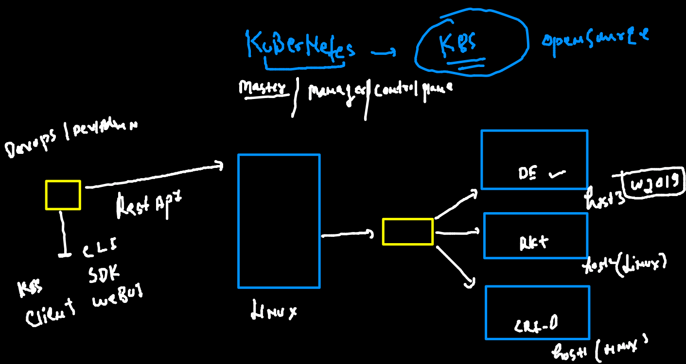
 
 ### kube-apiserver and kubelet (agent) of minion 
 
 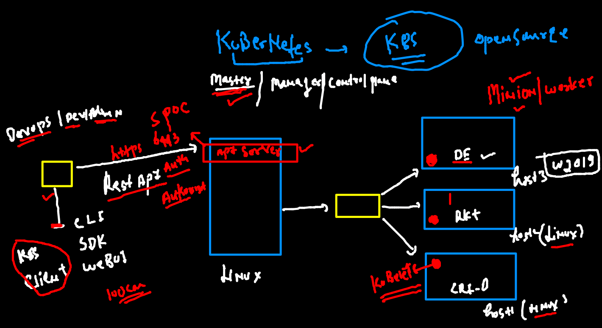
 
 ### k8s installation methods 
 
 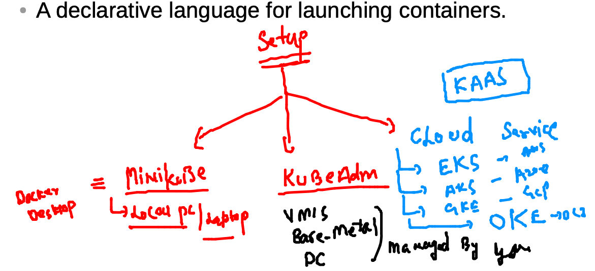
 
 ### Installing kubectl in client machine 
 
 ### Download apiserver auth file to interact 
 
 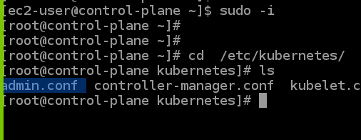
 
 ### checking client side 
 
 ```
 kubectl  version  --kubeconfig admin.conf.txt 
Client Version: version.Info{Major:"1", Minor:"21", GitVersion:"v1.21.1", GitCommit:"5e58841cce77d4bc13713ad2b91fa0d961e69192", GitTreeState:"clean", BuildDate:"2021-05-12T14:18:45Z", GoVersion:"go1.16.4", Compiler:"gc", Platform:"darwin/amd64"}
Server Version: version.Info{Major:"1", Minor:"22", GitVersion:"v1.22.3", GitCommit:"c92036820499fedefec0f847e2054d824aea6cd1", GitTreeState:"clean", BuildDate:"2021-10-27T18:35:25Z", GoVersion:"go1.16.9", Compiler:"gc", Platform:"linux/amd64"}

```

### getting nodes details 

```
 kubectl  get  nodes    --kubeconfig admin.conf.txt
NAME            STATUS   ROLES                  AGE     VERSION
control-plane   Ready    control-plane,master   6h29m   v1.22.3
node1           Ready    <none>                 6h28m   v1.22.3
node2           Ready    <none>                 6h28m   v1.22.3

```

###  api Server to ETCD 

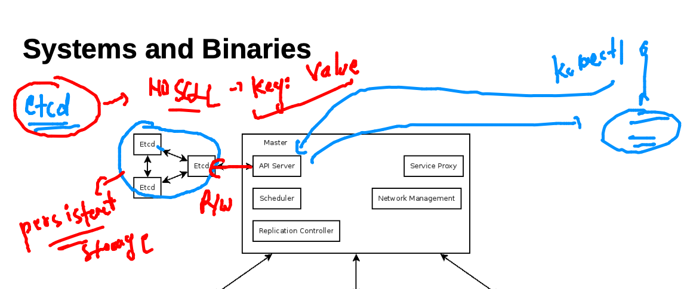


### Intro to POD in k8s 

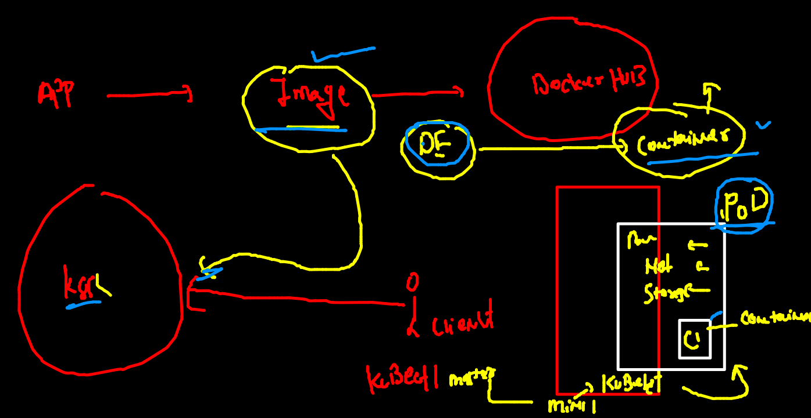

### a closure look to POD 


### POd example 1

```
apiVersion: v1 
kind: Pod 
metadata: # info about pod 
 name: ashupod-1  # name of pod 
spec: # info about application 
 containers:
 - name: ashuc1 # name of container 
   image: alpine # image from docker hub 
   command: ["sh","-c","ping localhost"] # parent process
 
```

### checking syntax of yaml without deploying it 

```
 kubectl  apply -f  ashupod1.yaml --dry-run=client
pod/ashupod-1 created (dry run)

```

### deploy pod and check 

```
 kubectl  apply -f  ashupod1.yaml                 
pod/ashupod-1 created
 fire@ashutoshhs-MacBook-Air  ~/Desktop/k8s_apps  kubectl  get  pods 
NAME        READY   STATUS              RESTARTS   AGE
ashupod-1   1/1     Running             0          13s
prepod-1    0/1     ContainerCreating   0          1s

```

###  kube-schedular 

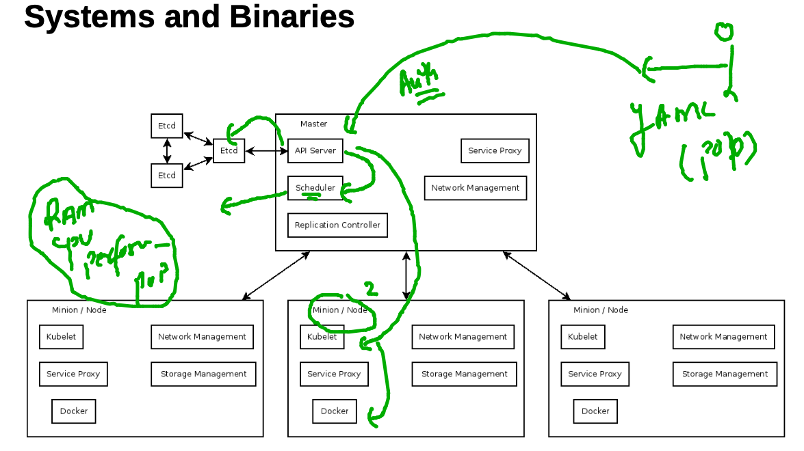

### checking minion node for the POD 

```
kubectl  get  pods  ashupod-1  -o wide
NAME        READY   STATUS    RESTARTS   AGE     IP                NODE    NOMINATED NODE   READINESS GATES
ashupod-1   1/1     Running   0          7m32s   192.168.166.135   node1   <none>           <none>

```

###

```
 kubectl  get  pods   -o wide          
NAME          READY   STATUS    RESTARTS   AGE     IP                NODE    NOMINATED NODE   READINESS GATES
abhishpod1    1/1     Running   0          7m28s   192.168.104.10    node2   <none>           <none>
amitpod-1     1/1     Running   0          7m40s   192.168.166.137   node1   <none>           <none>
anithapod-1   1/1     Running   0          7m54s   192.168.104.8     node2   <none>           <none>
anushapod-1   1/1     Running   0          6m55s   192.168.166.138   node1   <none>           <none>
archana       1/1     Running   0          4m9s    192.168.166.139   node1   <none>           <none>
ashupod-1     1/1     Running   0          8m29s   192.168.166.135   node1   <none>           <none>
dhanupod-1    1/1     Running   0          6m54s   192.168.104.11    node2   <none>           <none>
nitinpod-1    1/1     Running   0          7m56s   192.168.166.136   node1   <none>           <none>

```

### max info about pod 

```
kubectl describe pod ashupod-1
Name:         ashupod-1
Namespace:    default
Priority:     0
Node:         node1/172.31.31.235
Start Time:   Wed, 10 Nov 2021 16:43:00 +0530
Labels:       <none>
Annotations:  cni.projectcalico.org/containerID: a115caca690efebdb92fa73bf1819b74a6a1a1f645861a050e995aba7c34f642
              cni.projectcalico.org/podIP: 192.168.166.135/32
              cni.projectcalico.org/podIPs: 192.168.166.135/32
Status:       Running
IP:           192.168.166.135
IPs:
  IP:  192.168.166.135
Containers:
  ashuc1:
    Container ID:  docker://7758b0fb9a5500d9ffb520150367aecfd05724984679be83dbe623ec41f83683
    Image:         alpine
    
```

### checking output of pod container 

```
 kubectl logs -f  ashupod-1 
 
```

### access container inside pod 

```
kubectl  exec -it  ashupod-1   -- sh 
/ # 
/ # 
/ # 
/ # cat  /etc/os-release 
NAME="Alpine Linux"
ID=alpine
VERSION_ID=3.14.2
PRETTY_NAME="Alpine Linux v3.14"
HOME_URL="https://alpinelinux.org/"
BUG_REPORT_URL="https://bugs.alpinelinux.org/"
/ # ps -e
PID   USER     TIME  COMMAND
    1 root      0:00 ping localhost
    7 root      0:00 sh
   17 root      0:00 ps -e
/ # exit

```

### Deleting pod 

```
kubectl delete pod ashupod-1
pod "ashupod-1" deleted

 fire@ashutoshhs-MacBook-Air  ~/Desktop/k8s_apps  
 fire@ashutoshhs-MacBook-Air  ~/Desktop/k8s_apps  kubectl delete pod  --all   
pod "abhishpod1" deleted
pod "amitpod-1" deleted
pod "anithapod-1" deleted
pod "anushapod-1" deleted
pod "archana" deleted
pod "dhanupod-1" deleted
pod "nitinpod-1" deleted

```


