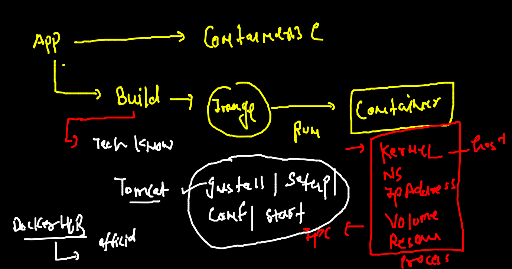
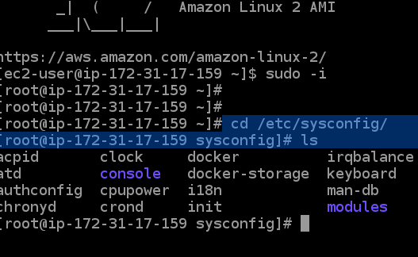
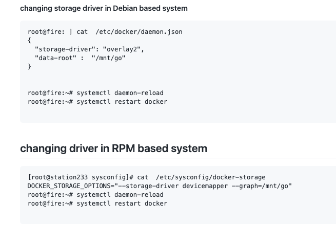
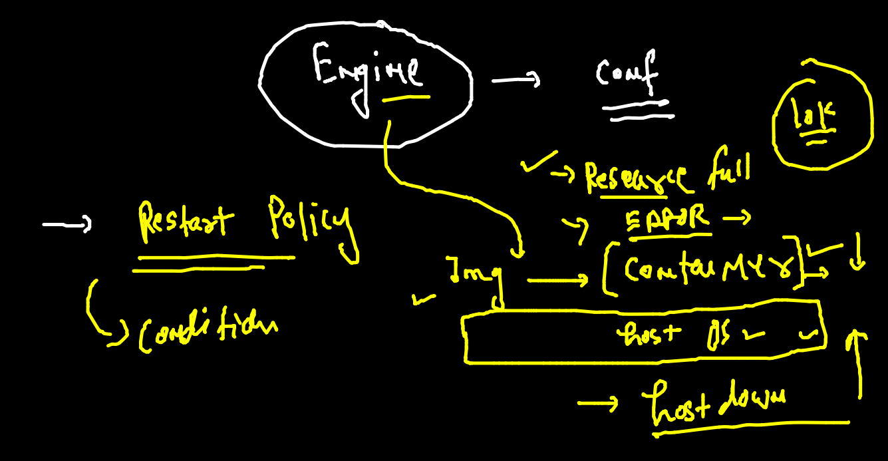
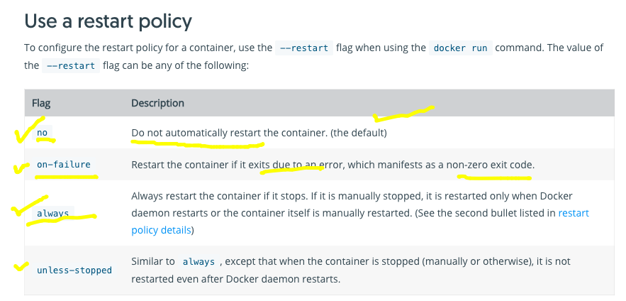
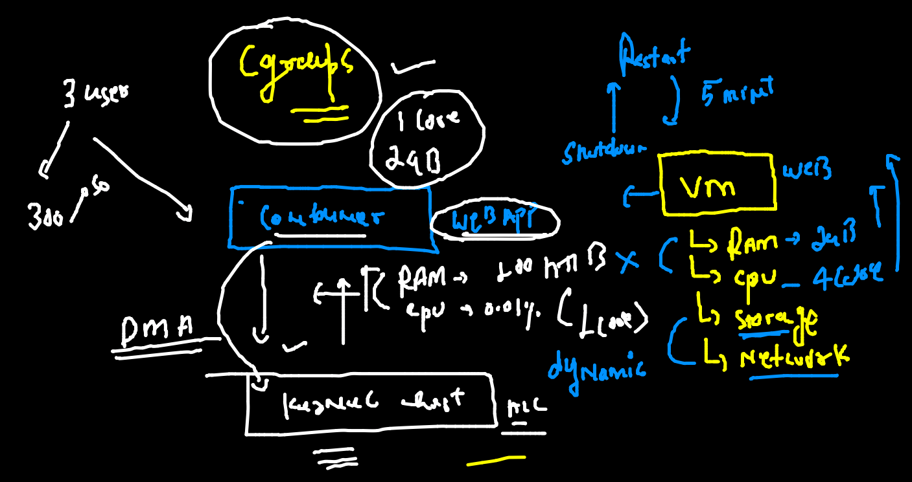
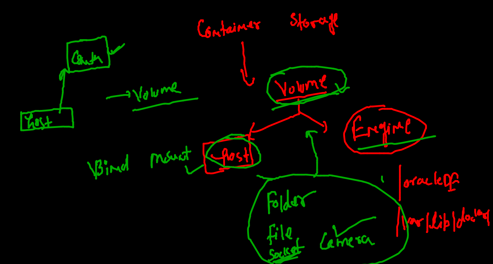
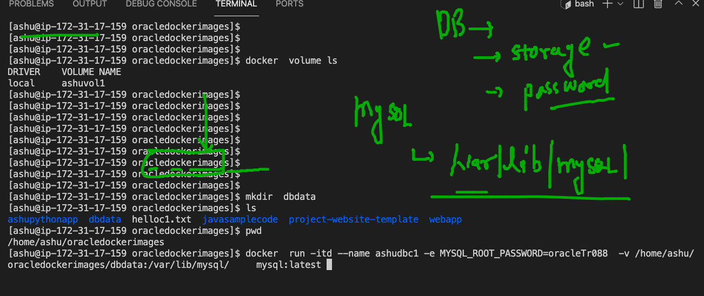

## Docker & container summary 



### Docker engine configuration on LInux 

### case 1



### case 2 



### Restart policy in docker engine for container 



### restart policy for containers 



### checking restart policy of any container 

```
docker  inspect  ashuc1  --format='{{.HostConfig.RestartPolicy.Name}}'
no

```

### setting restart policy during container creation time 

```
docker  run -itd --name ashuc2  --restart on-failure  c5f49a140b13  
ee0dee145bf83eed8ed891f70fcbee2e118d53ced780db97d157e127813cdf6e
```

###  Cgroups in Container 



### checking resources inside contaienr 

```
 362  docker  stats ashuc1
  363  docker  exec -itd  ashuc1  ping fb.com 
  364  docker  stats ashuc1
  365  docker  exec -itd  ashuc1  sleep 100 
  366  docker  stats ashuc1
  367  history 
[ashu@ip-172-31-17-159 oracledockerimages]$ docker  top  ashuc1
UID                 PID                 PPID                C                   STIME               TTY                 TIME                CMD
root                9545                9503                0                   04:35               pts/0               00:00:00            python3 /mycode/ashu.py
root                14480               9503                0                   04:48               pts/1               00:00:00            ping fb.com
root                14883               9503                0                   04:48               pts/2               00:00:00            sleep 100

```

### putting hardware limit to containers 

```
372  docker  run -itd --name ashuc3  --restart always --memory 100m   c5f49a140b13
  373  docker  run -itd --name ashuc4  --restart always --memory 100m  --cpu-shares=20  c5f49a140b13
  
```

## remove all data of docker engine 

```
 378  docker  rm $(docker ps -aq) -f
  379  docker rmi $(docker  images -q) -f
  380  history 
  381  docker  images 
  382  docker  ps -a
  383  docker network prune 
  384  docker volume rm $(docker  volume ls -q)
  
```

### Docker volume more details 



### deploy mysql db container 



### db container 

```
docker  run -itd --name ashudbc1 -e MYSQL_ROOT_PASSWORD=oracleTr088  -v /home/ashu/oracledockerimages/dbdata:/var/lib/mysql/     mysql

```

### check logs of db container 

```
 docker logs -f ashudbc1
2021-11-10 05:41:02+00:00 [Note] [Entrypoint]: Entrypoint script for MySQL Server 8.0.27-1debian10 started.
2021-11-10 05:41:02+00:00 [Note] [Entrypoint]: Switching to dedicated user 'mysql'
2021-11-10 05:41:02+00:00 [Note] [Entrypoint]: Entrypoint script for MySQL Server 8.0.27-1debian10 started.
2021-11-10 05:41:03+00:00 [Note] [Entrypoint]: Initializing database files
2021-11-10T05:41:03.066775Z 0 [System] [MY-013169] [Server] /usr/sbin/mysqld (m

21-11-10T05:41:30.741348Z 0 [System] [MY-010931] [Server] /usr/sbin/mysqld: ready for connections. Version: '8.0.27'  socket: '/var/run/mysqld/mysqld.sock'  port: 3306  MySQL Community Server - GPL.
^C

```

### checking details of db container 

```
docker  exec -it  ashudbc1  bash 
root@6e6d000e8f5a:/# 
root@6e6d000e8f5a:/# cat  /etc/os-release 
PRETTY_NAME="Debian GNU/Linux 10 (buster)"
NAME="Debian GNU/Linux"
VERSION_ID="10"
VERSION="10 (buster)"
VERSION_CODENAME=buster
ID=debian
HOME_URL="https://www.debian.org/"
SUPPORT_URL="https://www.debian.org/support"
BUG_REPORT_URL="https://bugs.debian.org/"

```

### connecting to db server 

```
root@6e6d000e8f5a:/# mysql -u root -p 
Enter password: 
Welcome to the MySQL monitor.  Commands end with ; or \g.
Your MySQL connection id is 8
Server version: 8.0.27 MySQL Community Server - GPL

Copyright (c) 2000, 2021, Oracle and/or its affiliates.

Oracle is a registered trademark of Oracle Corporation and/or its
affiliates. Other names may be trademarks of their respective
owners.

Type 'help;' or '\h' for help. Type '\c' to clear the current input statement.

mysql> show databases;
+--------------------+
| Database           |
+--------------------+
| information_schema |
| mysql              |
| performance_schema |
| sys                |
+--------------------+
4 rows in set (0.01 sec)

```

### docker webuI using portainer 

```
docker  run -itd  --restart  always  -p 9000:9000 -v  /var/run/docker.sock:/var/run/docker.sock  portainer/portainer 
Unable to find image 'portainer/portainer:latest' locally
latest: Pulling from portainer/portainer
94cfa856b2b1: Pull complete 
49d59ee0881a: Pull complete 
a2300fd28637: Pull complete 

```


