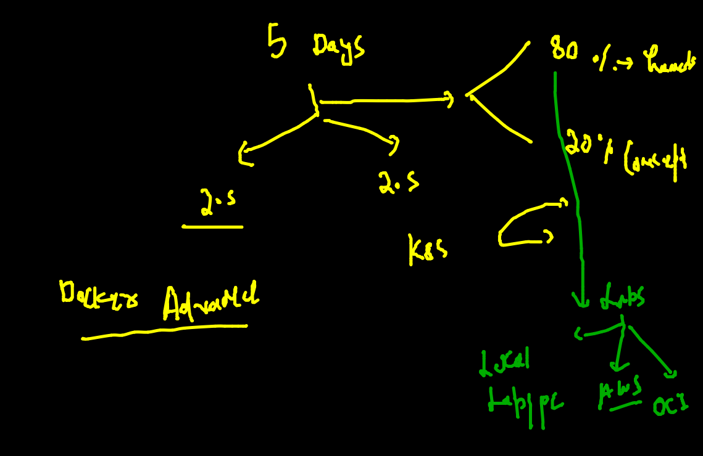
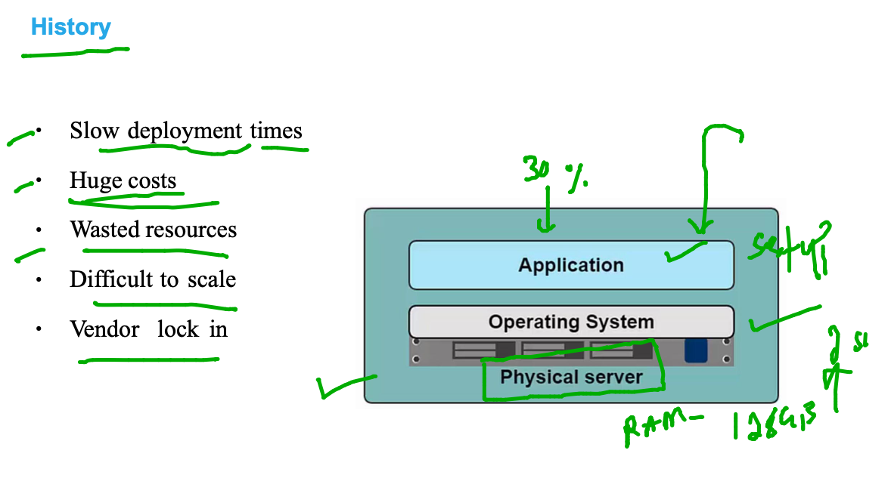
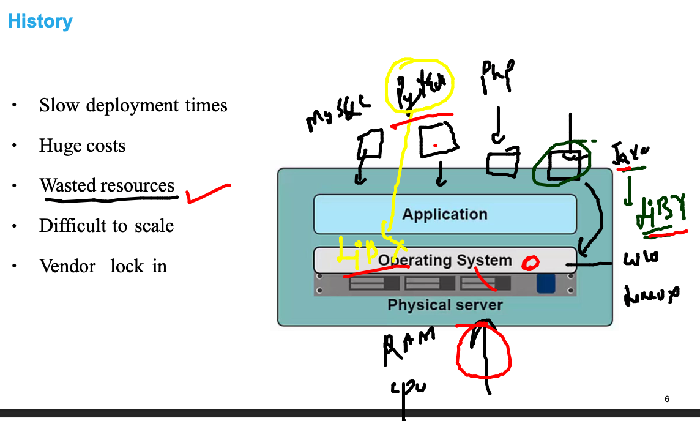
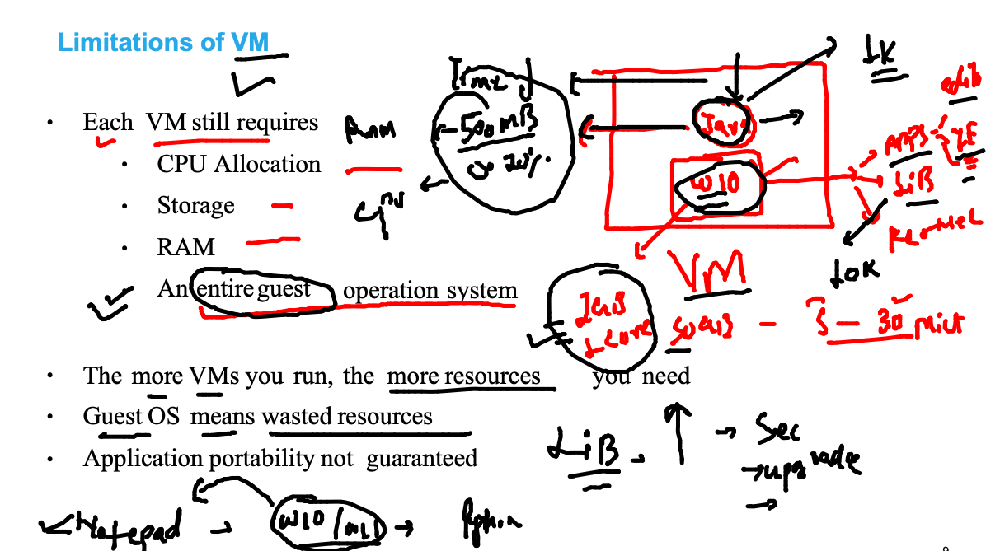
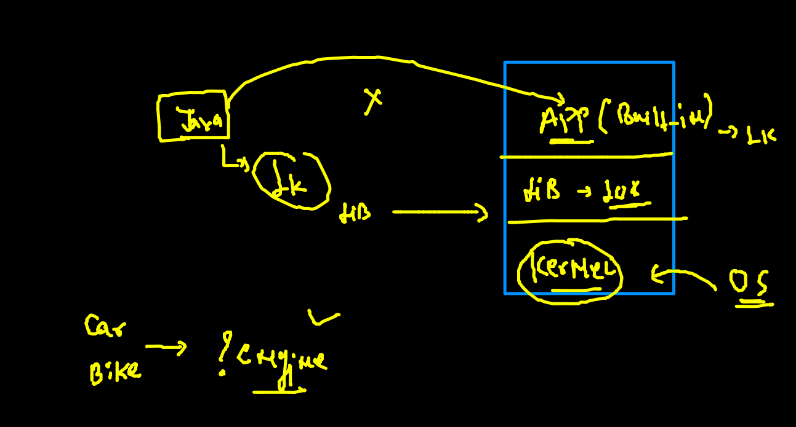
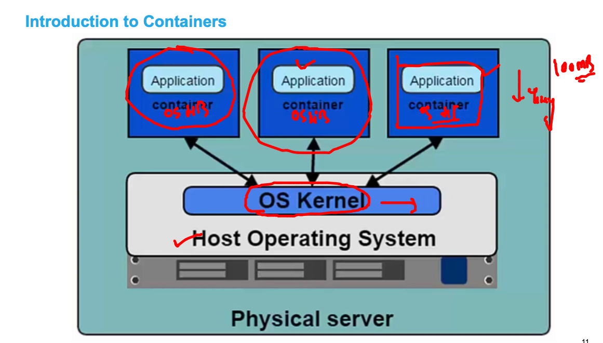
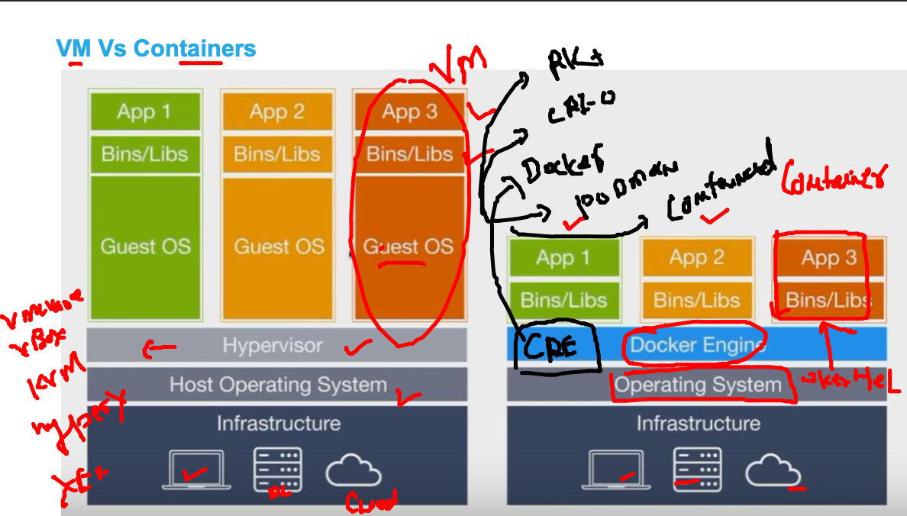
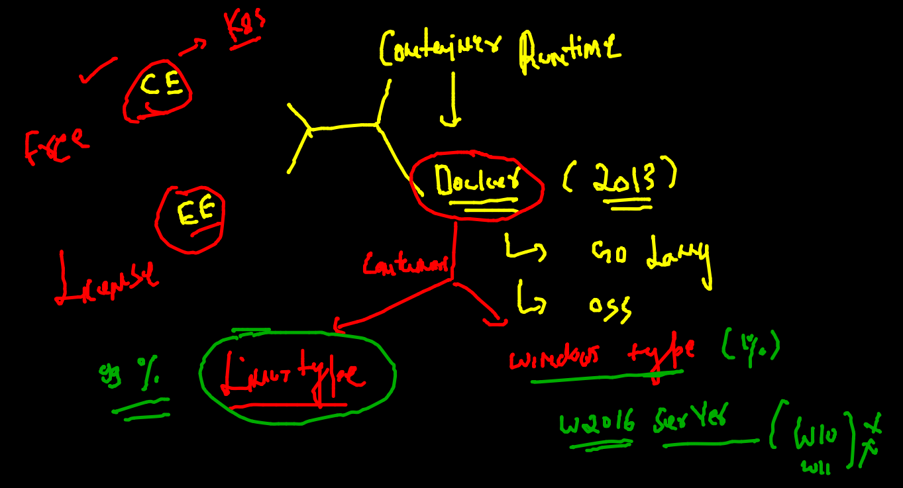

# Plan 

## app deployment in the past 

### multi apps can have prob 

### use of virtualization 

### vm is having problem because it need Entire OS 

### OS components 

### Intro to COntainers 

### vm vs containers 

### Docker only have windows and linux type containers

### Docker Installation 

