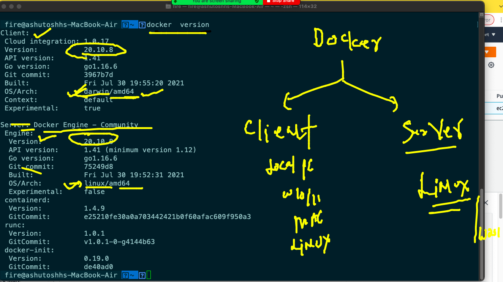
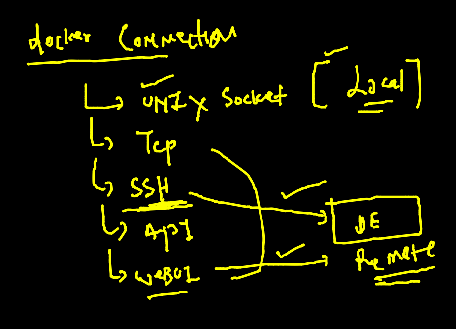
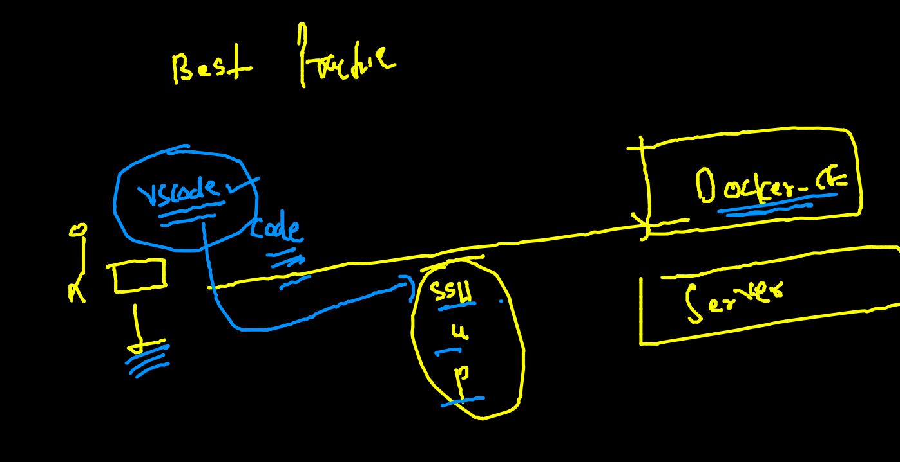
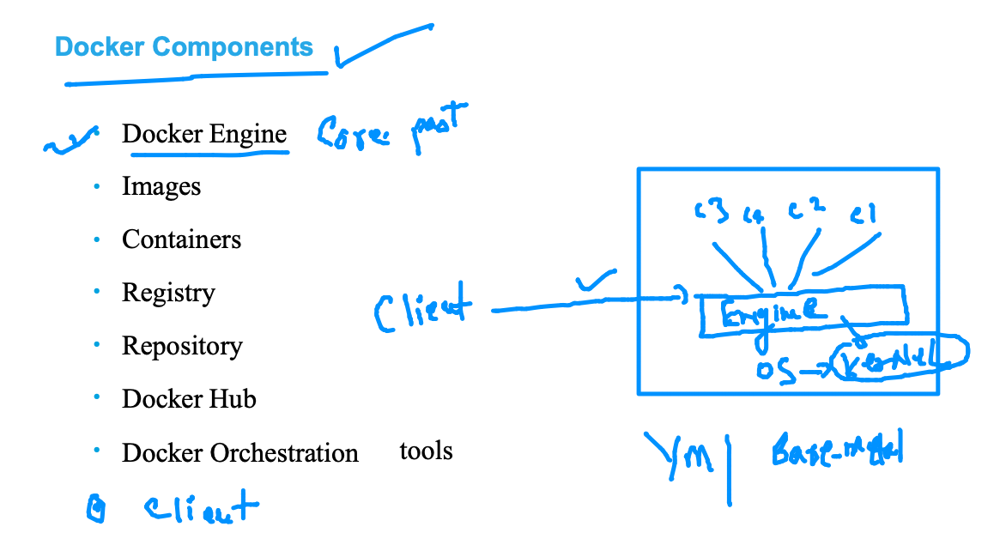
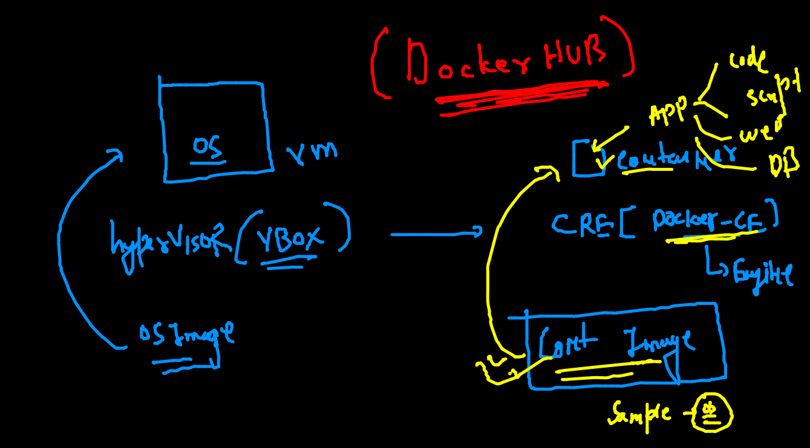
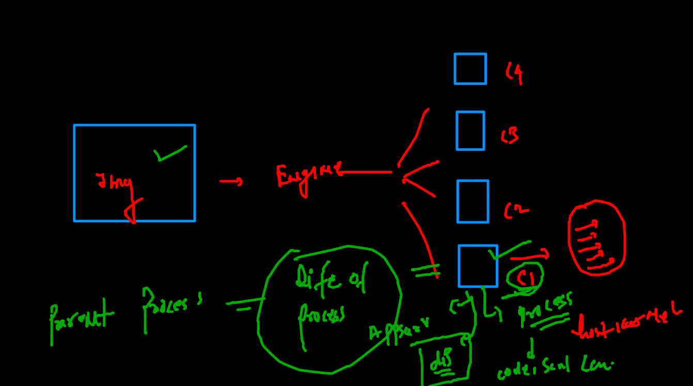
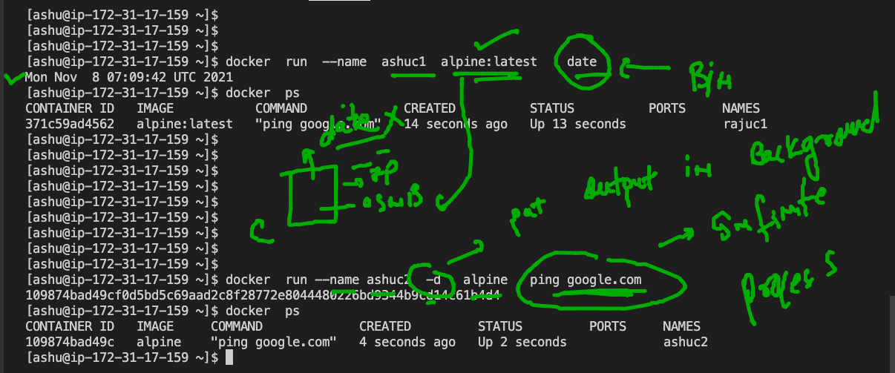

# Plan 


## app deployment in the past 


### multi apps can have prob 


### use of virtualization 


### vm is having problem because it need Entire OS 


### OS components 


### Intro to COntainers 


### vm vs containers 


### Docker only have windows and linux type containers


### Docker Installation 


### using docker Desktop 

### Docker installation locally 



## Installing docker CE in SErvers 

[Docker Install](https://docs.docker.com/engine/install/)

### Installing Docker ce in amazon Linux 

```
[root@ip-172-31-17-159 ~]# history 
    1  yum update -y
    2  yum  install docker  -y
    3  history 
[root@ip-172-31-17-159 ~]# 
[root@ip-172-31-17-159 ~]# 
[root@ip-172-31-17-159 ~]# 
[root@ip-172-31-17-159 ~]# systemctl start  docker 
[root@ip-172-31-17-159 ~]# systemctl enable  docker 
Created symlink from /etc/systemd/system/multi-user.target.wants/docker.service to /usr/lib/systemd/system/docker.service.
[root@ip-172-31-17-159 ~]# 

```

### TO connect docker we can use docker connections 



### Connecting checking from ssh to docker engine 

```
 fire@ashutoshhs-MacBook-Air  ~  ssh  ashu@34.235.28.14  
The authenticity of host '34.235.28.14 (34.235.28.14)' can't be established.
ECDSA key fingerprint is SHA256:6vjWxjcdCNyjltP0KKQcAEI+13ZjZ5lTi18+p1JmVtw.
Are you sure you want to continue connecting (yes/no/[fingerprint])? yes
Warning: Permanently added '34.235.28.14' (ECDSA) to the list of known hosts.
ashu@34.235.28.14's password: 

       __|  __|_  )
       _|  (     /   Amazon Linux 2 AMI
      ___|\___|___|

https://aws.amazon.com/amazon-linux-2/
-bash: warning: setlocale: LC_CTYPE: cannot change locale (UTF-8): No such file or directory
[ashu@ip-172-31-17-159 ~]$ 
[ashu@ip-172-31-17-159 ~]$ 
[ashu@ip-172-31-17-159 ~]$ docker  version 
Client:
 Version:           20.10.7
 API version:       1.41
 Go version:        go1.15.14
 Git commit:        f0df350
 Built:             Tue Sep 28 19:55:50 2021
 OS/Arch:           linux/amd64
 Context:           default
 Experimental:      true

Server:
 Engine:
  Version:          20.10.7


```

## Using Vscode to connectin Docker remotely 



## link to Download vscode 

[vscode](https://code.visualstudio.com/download)

### Docker COmponents 



### Docker images to create containers 



## Intro docker HUb 


## Docker basic Operations 


### Searching image from docker cli 

```
 docker  search  python 
NAME                             DESCRIPTION                                     STARS     OFFICIAL   AUTOMATED
python                           Python is an interpreted, interactive, objec…   6691      [OK]       
pypy                             PyPy is a fast, compliant alternative implem…   294       [OK]       
kaggle/python                    Docker image for Python scripts run on Kaggle   157                  [OK]
nikolaik/python-nodejs           Python with Node.js                             86                   [OK]
arm32v7/python                   Python is an interpreted, interactive, objec…   59                   
joyzoursky/python-chromedriver   Python with Chromedriver, for running automa…   59                   [OK]
centos/python-35-centos7         Platform for building and running Python 3.5…   39                   
hylang                           Hy is a Lisp 

```

## Container need any program / process to run 



###  image operations 

```
~]$ docker  images 
REPOSITORY   TAG       IMAGE ID   CREATED   SIZE
[ashu@ip-172-31-17-159 ~]$ 
[ashu@ip-172-31-17-159 ~]$ docker  pull  openjdk 
Using default tag: latest
latest: Pulling from library/openjdk
0a6167eaa66c: Pull complete 
9a88dabbf57e: Pull complete 
6b155ffb8976: Pull complete 
Digest: sha256:6440f0f9a320f11e90258ef7f9e6b07157259ef6b258d475fed6bc9a075ae169
Status: Downloaded newer image for openjdk:latest
docker.io/library/openjdk:latest
[ashu@ip-172-31-17-159 ~]$ docker  images 
REPOSITORY   TAG       IMAGE ID       CREATED      SIZE
openjdk      latest    deaa5a1a5f98   4 days ago   471MB
[ashu@ip-172-31-17-159 ~]$ 

```

### pulling images from Docker hub 

```
 docker  pull  oraclelinux:8.4 
8.4: Pulling from library/oraclelinux
a4df6f21af84: Pull complete 
Digest: sha256:b81d5b0638bb67030b207d28586d0e714a811cc612396dbe3410db406998b3ad
Status: Downloaded newer image for oraclelinux:8.4
docker.io/library/oraclelinux:8.4
[ashu@ip-172-31-17-159 ~]$ 
[ashu@ip-172-31-17-159 ~]$ docker  images 
REPOSITORY    TAG       IMAGE ID       CREATED        SIZE
openjdk       latest    deaa5a1a5f98   4 days ago     471MB
oraclelinux   8.4       97e22ab49eea   4 days ago     246MB
hello-world   latest    feb5d9fea6a5   6 weeks ago    13.3kB
alpine        latest    14119a10abf4   2 months ago   5.6MB

```

### image pull operations 

```
[ashu@ip-172-31-17-159 ~]$ docker  pull  mysql 
Using default tag: latest
latest: Pulling from library/mysql
b380bbd43752: Pull complete 
f23cbf2ecc5d: Pull complete 
30cfc6c29c0a: Pull complete 
b38609286cbe: Pull complete 
8211d9e66cd6: Pull complete 
2313f9eeca4a: Pull complete 
7eb487d00da0: Pull complete 
4d7421c8152e: Pull complete 
77f3d8811a28: Pull complete 
cce755338cba: Pull complete 
69b753046b9f: Pull complete 
b2e64b0ab53c: Pull complete 
Digest: sha256:6d7d4524463fe6e2b893ffc2b89543c81dec7ef82fb2020a1b27606666464d87
Status: Downloaded newer image for mysql:latest
docker.io/library/mysql:latest
[ashu@ip-172-31-17-159 ~]$ docker images 
REPOSITORY    TAG       IMAGE ID       CREATED        SIZE
openjdk       latest    deaa5a1a5f98   4 days ago     471MB
oraclelinux   8.4       97e22ab49eea   4 days ago     246MB
mysql         latest    ecac195d15af   2 weeks ago    516MB
hello-world   latest    feb5d9fea6a5   6 weeks ago    13.3kB
alpine        latest    14119a10abf4   2 months ago   5.6MB

```

### remove docker image from docker engine machine 

```
$ docker  rmi  ecac195d15af 
Untagged: mysql:latest
Untagged: mysql@sha256:6d7d4524463fe6e2b893ffc2b89543c81dec7ef82fb2020a1b27606666464d87
Deleted: sha256:ecac195d15afac2335de52fd7a0e34202fe582731963d31830f1b97700bf9509
Deleted: sha256:451fe04d80b84c0b7aca0f0bbdaa5de7c7ac85a65389ed5d3ed492f63ac092e2
Deleted: sha256:814cbf8bc7f6bb85685e5b803e16a76406c30d1960c566eee76303ffac600600
Deleted: sha256:735f72e1d1b936bb641b6a1283e4e60bf10a0c36f8244a5e3f8c7d58fa95b98a
Deleted: sha256:f2d209a30c3950fadffb2d82e1faa434da0753bee7aacad9cdec7d8a7a83df37
Deleted: sha256:03b9f8c5331d9534d2372a144bcffc8402e5f7972c9e4b85c634bef203ec6d20
Deleted: sha256:80f5487a88b8061855e99782979ed6069a8dd1c7dfbb1eb63fe42a4a9d119436
Deleted: sha256:f791a6c727931d41c51f8bf24ee32a4dbf0169f372b174f1ff89b4836b97c48e
Deleted: sha256:4c88df098412e11a98936509f3cede57f87154b350b0f75d96713f6e1dd56101
Deleted: sha256:fdba3a2cd286d9a5f65fc00f5254048855ae7dc00f3b3fa3356981eb9a7fe6d0
Deleted: sha256:8b3a69042e0da82429d28be0c474e73290ba4908730de22b2200a7aac9b245bd
Deleted: sha256:90afe56a0643f5bf1b1e8ee147b40a8e12b3fdd7e26bc2d2c50180d68dd524d0
Deleted: sha256:e81bff2725dbc0bf2003db10272fef362e882eb96353055778a66cda430cf81b
[ashu@ip-172-31-17-159 ~]$ docker images 
REPOSITORY    TAG       IMAGE ID       CREATED        SIZE
openjdk       latest    deaa5a1a5f98   4 days ago     471MB
oraclelinux   8.4       97e22ab49eea   4 days ago     246MB
hello-world   latest    feb5d9fea6a5   6 weeks ago    13.3kB
alpine        latest    14119a10abf4   2 months ago   5.6MB

```

### creating container 



```
docker  run --name ashuc2  -d   alpine   ping google.com 
109874bad49cf0d5bd5c69aad2c8f28772e8044480226bd9344b9cd14c61b4d4
[ashu@ip-172-31-17-159 ~]$ docker  ps
CONTAINER ID   IMAGE     COMMAND             CREATED         STATUS         PORTS     NAMES
109874bad49c   alpine    "ping google.com"   4 seconds ago   Up 2 seconds             ashuc2

```

### list of running containers 

```
[ashu@ip-172-31-17-159 ~]$ docker  ps
CONTAINER ID   IMAGE           COMMAND             CREATED              STATUS              PORTS     NAMES
943d6bd003c1   alpine:latest   "ping google.com"   4 seconds ago        Up 3 seconds                  abhishek1
2d5654009f76   alpine          "ping google.com"   9 seconds ago        Up 8 seconds                  dhanuv1
e0efcf675ca9   alpine:latest   "ping google.com"   53 seconds ago       Up 52 seconds                 vijayc2
c10038f75b2d   alpine          "ping google.com"   About a minute ago   Up 59 seconds                 amitc1
1fe82e0a1792   alpine:latest   "ping google.com"   About a minute ago   Up About a minute             rajuc1
109874bad49c   alpine          "ping google.com"   About a minute ago   Up About a minute             ashuc2

```

### checking output of process running inside container 

```
$ docker  logs   ashuc2
PING google.com (142.250.188.206): 56 data bytes
64 bytes from 142.250.188.206: seq=0 ttl=108 time=1.016 ms
64 bytes from 142.250.188.206: seq=1 ttl=108 time=1.036 ms
64 bytes from 142.250.188.206: seq=2 ttl=108 time=1.105 ms
64 bytes from 142.250.188.206: seq=3 ttl=108 time=1.247 ms
64 bytes from 142.250.188.206: seq=4 ttl=108 time=1.119 ms

```

### live output check 

```
docker  logs  -f  ashuc2

```

### checking resource consumption of container 

```
[ashu@ip-172-31-17-159 ~]$ docker  stats  ashuc2
CONTAINER ID   NAME      CPU %     MEM USAGE / LIMIT   MEM %     NET I/O         BLOCK I/O   PIDS
109874bad49c   ashuc2    0.01%     648KiB / 7.689GiB   0.01%     36kB / 34.3kB   0B / 0B     1
^C


````

### stopping a running container manually 

```
 docker  stop  ashuc2 

```

### starting same container 

```
docker  start   ashuc2 
ashuc2
[ashu@ip-172-31-17-159 ~]$ docker  ps
CONTAINER ID   IMAGE           COMMAND             CREATED         STATUS          PORTS     NAMES
a3460308bd26   alpine          "ping google.com"   6 minutes ago   Up 6 minutes              advc1
f3417454b99e   alpine          "ping google.com"   6 minutes ago   Up 8 seconds              anushac1
3200977d15de   alpine          "ping google.com"   6 minutes ago   Up 6 minutes              archana
2d5654009f76   alpine          "ping google.com"   7 minutes ago   Up 7 minutes              dhanuv1
e0efcf675ca9   alpine:latest   "ping google.com"   7 minutes ago   Up 7 minutes              vijayc2
c10038f75b2d   alpine          "ping google.com"   7 minutes ago   Up 7 minutes              amitc1
109874bad49c   alpine          "ping google.com"   8 minutes ago   Up 16 seconds             ashuc2

```

### forcefully killing a contaier to be stopped 

```
docker  kill ashuc2
ashuc2
[ashu@ip-172-31-17-159 ~]$ docker  start  ashuc2
ashuc2

```
### accessing container shell 

```
 docker  exec  -it   ashuc2   sh  
/ # ls
bin    etc    lib    mnt    proc   run    srv    tmp    var
dev    home   media  opt    root   sbin   sys    usr
/ # ps -e
PID   USER     TIME  COMMAND
    1 root      0:00 ping google.com
    9 root      0:00 sh
   16 root      0:00 ps -e
/ # whoami 
root
/ # uname 
Linux
/ # exit

```

### removing container forever 

```
[ashu@ip-172-31-17-159 ~]$ docker  stop  ashuc2
ashuc2
[ashu@ip-172-31-17-159 ~]$ docker  rm  ashuc2
ashuc2

```


