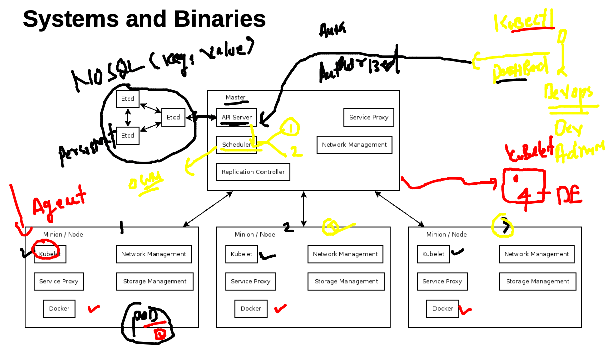
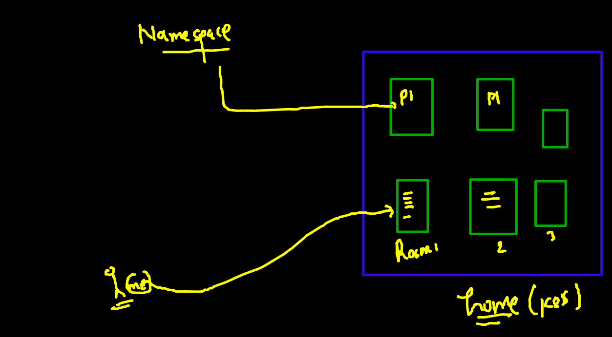
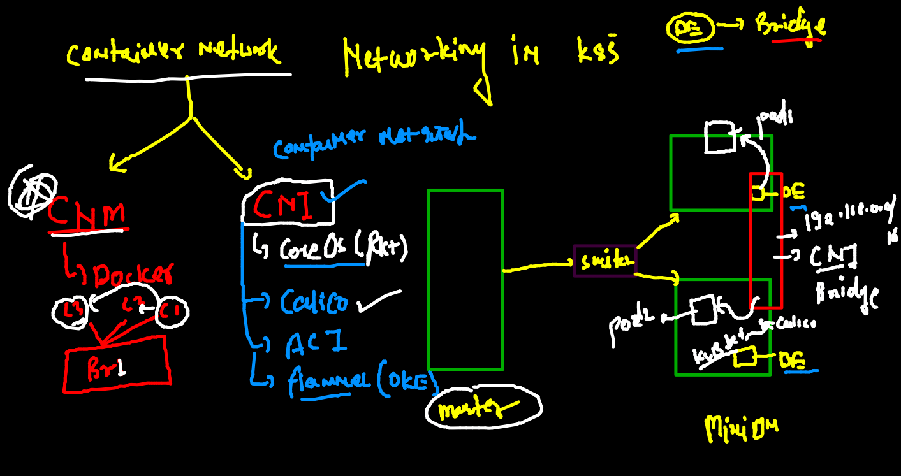
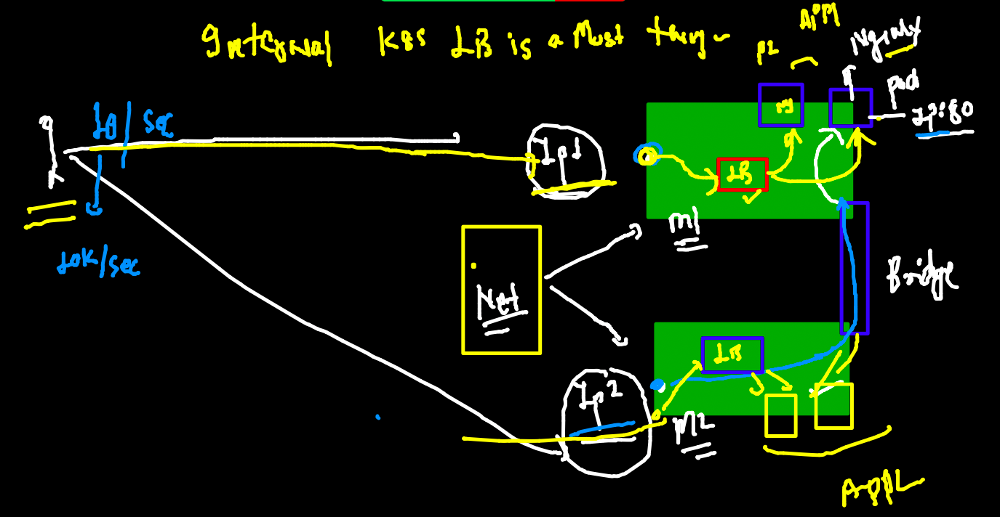
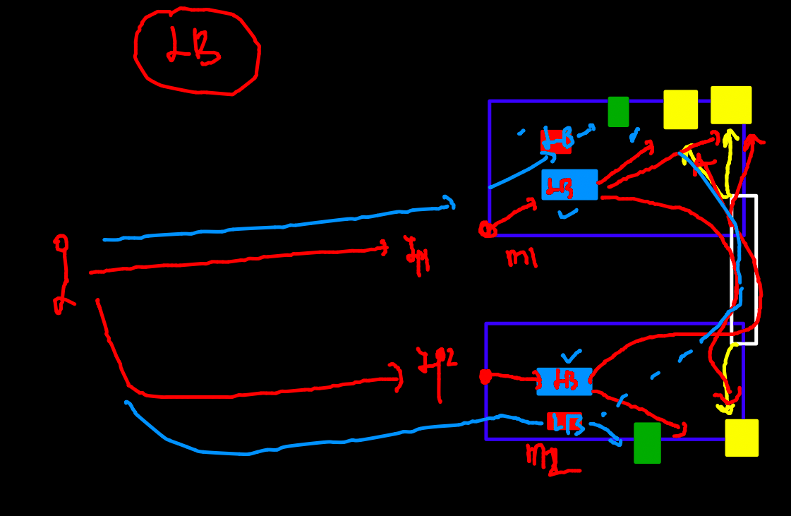
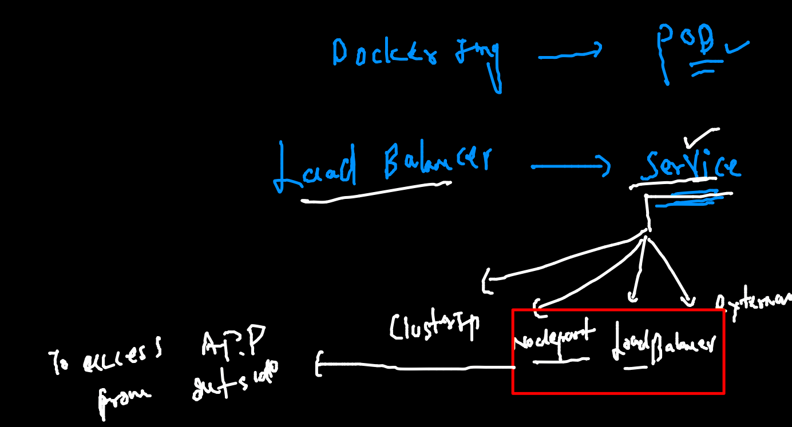
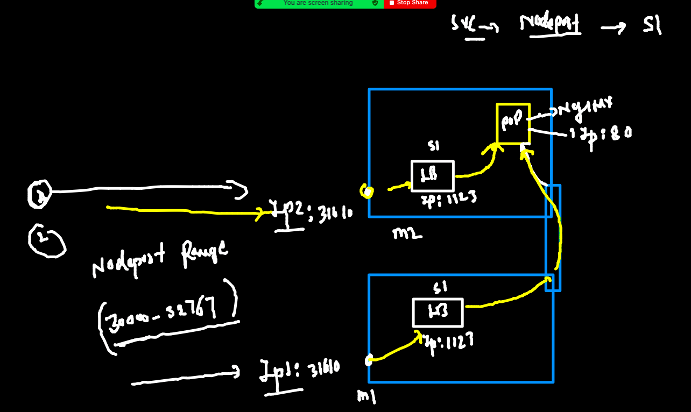
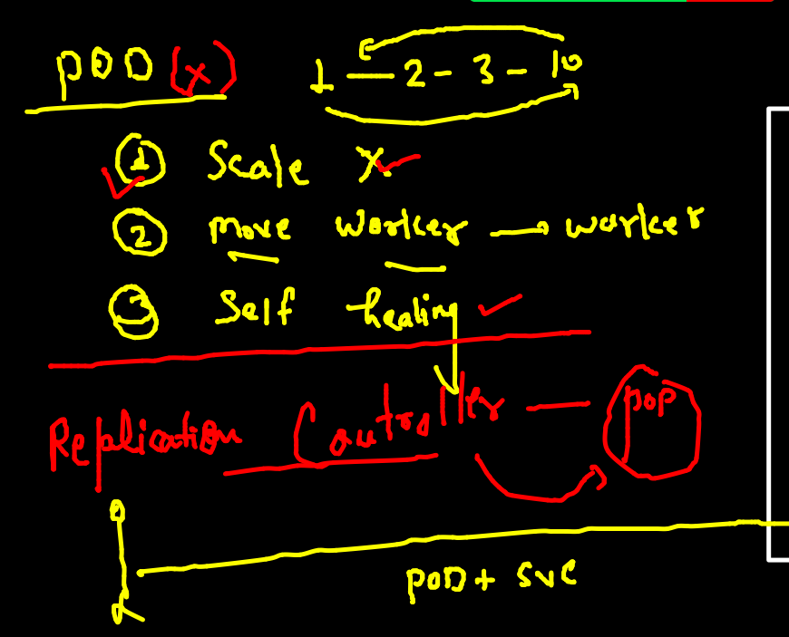
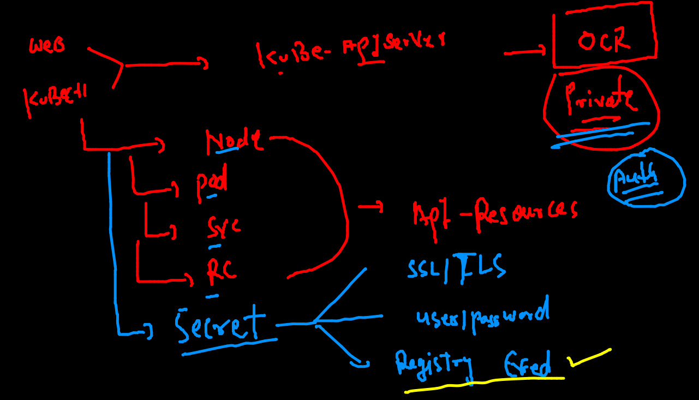

# k8s revision 



### checking connection to master 

```
kubectl  get  nodes
NAME            STATUS   ROLES                  AGE   VERSION
control-plane   Ready    control-plane,master   25h   v1.22.3
node1           Ready    <none>                 25h   v1.22.3
node2           Ready    <none>                 25h   v1.22.3

```

### checking pod status 

```
 kubectl  get  po   
NAME          READY   STATUS    RESTARTS      AGE
abhishpod1    1/1     Running   1 (17h ago)   17h
amitpod-1     1/1     Running   1 (17h ago)   17h
anushapod-1   1/1     Running   1 (17h ago)   17h

```

### auto generate yaml 

```
kubectl  run  ashupod2 --image=nginx --port 80  --dry-run=client -o yaml 
apiVersion: v1
kind: Pod
metadata:
  creationTimestamp: null
  labels:
    run: ashupod2
  name: ashupod2
spec:
  containers:
  - image: nginx
    name: ashupod2
    ports:
    - containerPort: 80
    resources: {}
  dnsPolicy: ClusterFirst
  restartPolicy: Always
status: {}

```

### save output in a file 

```
 kubectl  run  ashupod2 --image=nginx --port 80  --dry-run=client -o yaml >pod2.yaml
```

## Understanding namespace in k8s 



### list of namespades 

```
kubectl  get  ns
NAME                   STATUS   AGE
default                Active   25h
kube-node-lease        Active   25h
kube-public            Active   25h
kube-system            Active   25h
kubernetes-dashboard   Active   25h
```

### k8s components are running as pod 

```
kubectl  get  po -n kube-system
NAME                                       READY   STATUS    RESTARTS      AGE
calico-kube-controllers-5d995d45d6-gggbt   1/1     Running   2 (17h ago)   25h
calico-node-fl5t8                          1/1     Running   2 (17h ago)   25h
calico-node-qx5hh                          1/1     Running   2 (17h ago)   25h
calico-node-r5r9j                          1/1     Running   2 (17h ago)   25h
coredns-78fcd69978-d4rbj                   1/1     Running   2 (17h ago)   25h
coredns-78fcd69978-jg78s                   1/1     Running   2 (17h ago)   25h
etcd-control-plane                         1/1     Running   2 (17h ago)   25h
kube-apiserver-control-plane               1/1     Running   2 (17h ago)   25h
kube-controller-manager-control-plane      1/1     Running   2 (17h ago)   25h
kube-proxy-cbhcm                           1/1     Running   2 (17h ago)   25h
kube-proxy-jvlxz                           1/1     Running   2 (17h ago)   25h
kube-proxy-xzrsm                           1/1     Running   2 (17h ago)   25h
kube-scheduler-control-plane               1/1     Running   2 (17h ago)   25h
metrics-server-6fb5c69669-zsg2q            1/1     Running   2 (17h ago)   25h

```

### creating namespaces 

```
kubectl  create  namespace  ashu-space                           
namespace/ashu-space created
 fire@ashutoshhs-MacBook-Air  ~/Desktop/k8s_apps  kubectl  get  ns                                                 
NAME                   STATUS   AGE
ashu-space             Active   5s
default                Active   25h
kube-node-lease        Active   25h
kube-public            Active   25h
kube-system            Active   25h
kubernetes-dashboard   Active   25h
rajuspace              Active   33s

```

### settting default namespace 

```
kubectl  config set-context --current --namespace=ashu-space 
Context "kubernetes-admin@kubernetes" modified.
 fire@ashutoshhs-MacBook-Air  ~/Desktop/k8s_apps  
 fire@ashutoshhs-MacBook-Air  ~/Desktop/k8s_apps  kubectl  get  po                                             
No resources found in ashu-space namespace.
 fire@ashutoshhs-MacBook-Air  ~/Desktop/k8s_apps  
 fire@ashutoshhs-MacBook-Air  ~/Desktop/k8s_apps  kubectl  config  get-contexts 
CURRENT   NAME                          CLUSTER      AUTHINFO           NAMESPACE
*         kubernetes-admin@kubernetes   kubernetes   kubernetes-admin   ashu-space

```

###  task done 

```
 kubectl  run ashupod1  --image=busybox --command ping fb.com -n tasks 
 6388  kubectl  get  po -n tasks 
 6389  kubectl  logs  ashupod1  -n tasks 
 6390  kubectl  logs  ashupod1  -n tasks  >logs.txt
 6391  ls
 6392  kubectl  exec -it  ashupod1 -n tasks -- sh 
 6393  kubectl cp logs.txt  ashupod1:/opt/ -n tasks 
 6394  kubectl  exec -it  ashupod1 -n tasks -- sh 
 6395  kubectl  get  po -n tasks -o wide
 6396  kubectl  exec -it  ashupod1 -n tasks -- sh 
 
 ```
 
 ### pod from diff minion node can connect to each other 
 
 ```
 kubectl  get  po -o wide -n tasks 
NAME            READY   STATUS    RESTARTS   AGE   IP                NODE    NOMINATED NODE   READINESS GATES
amitpod1        1/1     Running   0          23m   192.168.166.168   node1   <none>           <none>
anushapod1      1/1     Running   0          48m   192.168.104.33    node2   <none>           <none>
archanapod1     1/1     Running   0          51m   192.168.166.163   node1   <none>           <none>
ashupod1        1/1     Running   0          37m   192.168.166.167   node1   <none>           <none>
dhanushpod1     1/1     Running   0          33m   192.168.104.42    node2   <none>           <none>
gauravbusybox   1/1     Running   0          29m   192.168.104.43    node2   <none>           <none>
pavanipod1      1/1     Running   0          43m   192.168.166.166   node1   <none>           <none>
rajutask        1/1     Running   0          53m   192.168.104.32    node2   <none>           <none>
 fire@ashutoshhs-MacBook-Air  ~/Desktop/k8s_apps  kubectl exec  -it  amitpod1 -n tasks -- sh 
/ # ping 192.168.104.33
PING 192.168.104.33 (192.168.104.33): 56 data bytes
64 bytes from 192.168.104.33: seq=0 ttl=253 time=0.516 ms
64 bytes from 192.168.104.33: seq=1 ttl=253 time=0.327 ms

```
### POd Networking with calico CNI 



### creating webapp POD yaml 

```
kubectl  run  ashuweb  --image=dockerashu/nginx:11nov2021   --port 80 --dry-run=client -o yaml 
apiVersion: v1
kind: Pod
metadata:
  creationTimestamp: null
  labels:
    run: ashuweb
  name: ashuweb
spec:
  containers:
  - image: dockerashu/nginx:11nov2021
    name: ashuweb
    ports:
    - containerPort: 80
    resources: {}
  dnsPolicy: ClusterFirst
  restartPolicy: Always
status: {}
 fire@ashutoshhs-MacBook-Air  ~/Desktop/k8s_apps  kubectl  run  ashuweb  --image=dockerashu/nginx:11nov2021   --port 80 --dry-run=client -o yaml  >nginxapp.yaml 
 
 ```
 
 ### deploy webapp using pod 
 
 ```
  kubectl apply -f  nginxapp.yaml 
pod/ashuweb created
 fire@ashutoshhs-MacBook-Air  ~/Desktop/k8s_apps  kubectl  get po 
NAME      READY   STATUS    RESTARTS   AGE
ashuweb   1/1     Running   0          6s
 fire@ashutoshhs-MacBook-Air  ~/Desktop/k8s_apps  kubectl  get po -o wide
NAME      READY   STATUS    RESTARTS   AGE   IP               NODE    NOMINATED NODE   READINESS GATES
ashuweb   1/1     Running   0          12s   192.168.104.45   node2   <none>           <none>

```

### access app locally 

```
kubectl  get  po 
NAME      READY   STATUS    RESTARTS   AGE
ashuweb   1/1     Running   0          6m2s
 fire@ashutoshhs-MacBook-Air  ~/Desktop/k8s_apps  kubectl  port-forward  1122:80  ashuweb 
Error from server (NotFound): pods "1122:80" not found
 ✘ fire@ashutoshhs-MacBook-Air  ~/Desktop/k8s_apps  kubectl  port-forward  ashuweb  1122:80 
Forwarding from 127.0.0.1:1122 -> 80
Forwarding from [::1]:1122 -> 80
Handling connection for 1122
Handling connection for 1122
^C%                                                                

```

### Internal Loadbalancer for k8s 



## Loadbalancer 



### Intro to service 



## checking label of POD 

```
 kubectl apply -f  nginxapp.yaml 
pod/ashuweb configured
 fire@ashutoshhs-MacBook-Air  ~/Desktop/k8s_apps  kubectl  get po --show-labels 
NAME      READY   STATUS    RESTARTS   AGE   LABELS
ashuweb   1/1     Running   0          35m   x=ashuwebapp

```

### creating service 

```
kubectl  create service 
Create a service using specified subcommand.

Aliases:
service, svc

Available Commands:
  clusterip    Create a ClusterIP service.
  externalname Create an ExternalName service.
  loadbalancer Create a LoadBalancer service.
  nodeport     Create a NodePort service.
```
### my service of nodeport type 

```
 kubectl  create service  nodeport  ashusvc1 --tcp 1123:80  --dry-run=client  -o yaml  
apiVersion: v1
kind: Service
metadata:
  creationTimestamp: null
  labels:
    app: ashusvc1
  name: ashusvc1
spec:
  ports:
  - name: 1123-80
    port: 1123
    protocol: TCP
    targetPort: 80
  selector:
    app: ashusvc1
  type: NodePort
status:
  loadBalancer: {}
 fire@ashutoshhs-MacBook-Air  ~/Desktop/k8s_apps  kubectl  create service  nodeport  ashusvc1 --tcp 1123:80  --dry-run=client  -o yaml  >mysvc.yaml
```
 ### Nodeport type service done 
 ```
  kubectl  get po --show-labels
NAME      READY   STATUS    RESTARTS   AGE   LABELS
ashuweb   1/1     Running   0          42m   x=ashuwebapp
 fire@ashutoshhs-MacBook-Air  ~/Desktop/k8s_apps  kubectl apply -f  mysvc.yaml 
service/ashusvc1 created
 fire@ashutoshhs-MacBook-Air  ~/Desktop/k8s_apps  kubectl  get  service       
NAME       TYPE       CLUSTER-IP      EXTERNAL-IP   PORT(S)          AGE
ashusvc1   NodePort   10.103.190.18   <none>        1123:31610/TCP   16s

```

### nodeport working 


### problem with pod and solution with RC 



### RC deploy 

```
apiVersion: v1
kind: ReplicationController 
metadata:
 name: ashu-rc1 # name of RC
spec: 
 replicas: 1 # number of pod to start with 
 template: # RC will be using pod template to create Pod apps 
  metadata:
   labels: # label of pod 
    x1: helloashu1 
  spec: 
   containers:
   - image: dockerashu/nginx:11nov2021
     name: ashuc1 
     ports:
     - containerPort: 80 
  
```

### deploying rc 

```
kubectl apply -f  ashurc.yaml 
replicationcontroller/ashu-rc1 created
service/ashusvc2 created
 fire@ashutoshhs-MacBook-Air  ~/Desktop/k8s_apps  
 fire@ashutoshhs-MacBook-Air  ~/Desktop/k8s_apps  kubectl  get  rc
NAME       DESIRED   CURRENT   READY   AGE
ashu-rc1   1         1         1       6s
 fire@ashutoshhs-MacBook-Air  ~/Desktop/k8s_apps  kubectl  get  po  
NAME             READY   STATUS    RESTARTS   AGE
ashu-rc1-mrjng   1/1     Running   0          16s
 fire@ashutoshhs-MacBook-Air  ~/Desktop/k8s_apps  kubectl  get  svc
NAME       TYPE       CLUSTER-IP      EXTERNAL-IP   PORT(S)          AGE
ashusvc2   NodePort   10.99.156.211   <none>        1133:32023/TCP   21s

```

### self healing method 

```
 kubectl  delete  pod ashu-rc1-mrjng
pod "ashu-rc1-mrjng" deleted
 fire@ashutoshhs-MacBook-Air  ~/Desktop/k8s_apps  kubectl  get  po                   
NAME             READY   STATUS    RESTARTS   AGE
ashu-rc1-dq2rn   1/1     Running   0          5s

```

## scaling pod 

```

 fire@ashutoshhs-MacBook-Air  ~/Desktop/k8s_apps  kubectl scale rc  ashu-rc1 --replicas=3
replicationcontroller/ashu-rc1 scaled
 fire@ashutoshhs-MacBook-Air  ~/Desktop/k8s_apps  
 fire@ashutoshhs-MacBook-Air  ~/Desktop/k8s_apps  kubectl  get  po                       
NAME             READY   STATUS              RESTARTS   AGE
ashu-rc1-7zpjj   0/1     ContainerCreating   0          4s
ashu-rc1-dq2rn   1/1     Running             0          2m41s
ashu-rc1-pvcqj   0/1     ContainerCreating   0          4s
```
### Deletion of all resources in namespace 

```
kubectl  delete all --all
pod "ashu-rc1-dq2rn" deleted
replicationcontroller "ashu-rc1" deleted
service "ashusvc2" deleted
```

### creating pod from private docker registry 

```
kubectl  run  ashuweb111  --image=phx.ocir.io/axmbtg8judkl/oraclewebapp:v1   --port 80  --dry-run=client -o yaml 
apiVersion: v1
kind: Pod
metadata:
  creationTimestamp: null
  labels:
    run: ashuweb111
  name: ashuweb111
spec:
  containers:
  - image: phx.ocir.io/axmbtg8judkl/oraclewebapp:v1
    name: ashuweb111
    ports:
    - containerPort: 80
    resources: {}
  dnsPolicy: ClusterFirst
  restartPolicy: Always
status: {}
 fire@ashutoshhs-MacBook-Air  ~/Desktop/k8s_apps  kubectl  run  ashuweb111  --image=phx.ocir.io/axmbtg8judkl/oraclewebapp:v1   --port 80  --dry-run=client -o yaml  >privateapp.yml
```

### introduction to secret in k8s 



### creating secret 

```
kubectl  create  secret 
Create a secret using specified subcommand.

Available Commands:
  docker-registry Create a secret for use with a Docker registry
  generic         Create a secret from a local file, directory or literal value
  tls             Create a TLS secret

Usage:
```
### creating 

```
kubectl  create  secret  docker-registry  ocrsec  --docker-server=phx.ocir.io  --docker-username=axmdkl/learntechbyme@gmail.com     --docker-password=").fMCd1>t[sEDO"

kubectl  get  secret 
NAME                  TYPE                                  DATA   AGE
default-token-gsqhm   kubernetes.io/service-account-token   3      4h51m
ocrsec                kubernetes.io/dockerconfigjson        1      7s
```

### replace with secret details 

```
kubectl replace -f  privateapp.yml --force
pod "ashuweb111" deleted
pod/ashuweb111 replaced
 fire@ashutoshhs-MacBook-Air  ~/Desktop/k8s_apps  kubectl  get  po 
NAME         READY   STATUS    RESTARTS   AGE
ashuweb111   1/1     Running   0          16s
```

### auto create service using pod 
```
 kubectl  get  po --show-labels
NAME         READY   STATUS    RESTARTS   AGE   LABELS
ashuweb111   1/1     Running   0          90s   run=ashuweb111
 fire@ashutoshhs-MacBook-Air  ~/Desktop/k8s_apps  kubectl  expose pod ashuweb111  --type NodePort --port 80 --name svc4 
service/svc4 exposed
 fire@ashutoshhs-MacBook-Air  ~/Desktop/k8s_apps  kubectl  get  svc
NAME   TYPE       CLUSTER-IP      EXTERNAL-IP   PORT(S)        AGE
svc4   NodePort   10.107.58.130   <none>        80:30051/TCP   9s
 fire@ashutoshhs-MacBook-Air  ~/Desktop/k8s_apps  kubectl  get  svc -o wide
NAME   TYPE       CLUSTER-IP      EXTERNAL-IP   PORT(S)        AGE   SELECTOR
svc4   NodePort   10.107.58.130   <none>        80:30051/TCP   67s   run=ashuweb111
```


