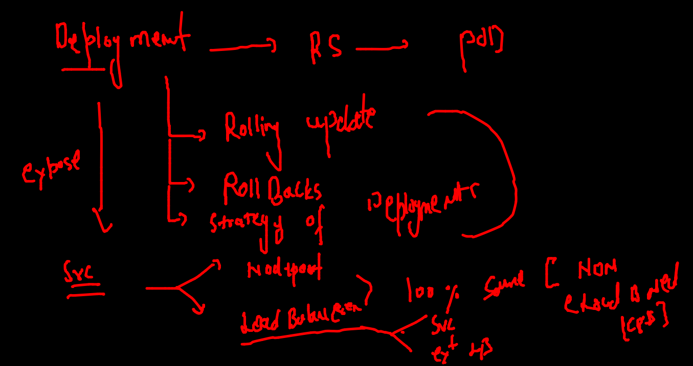
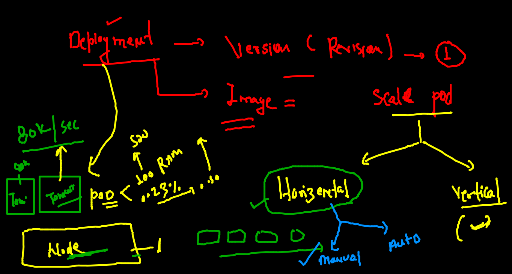
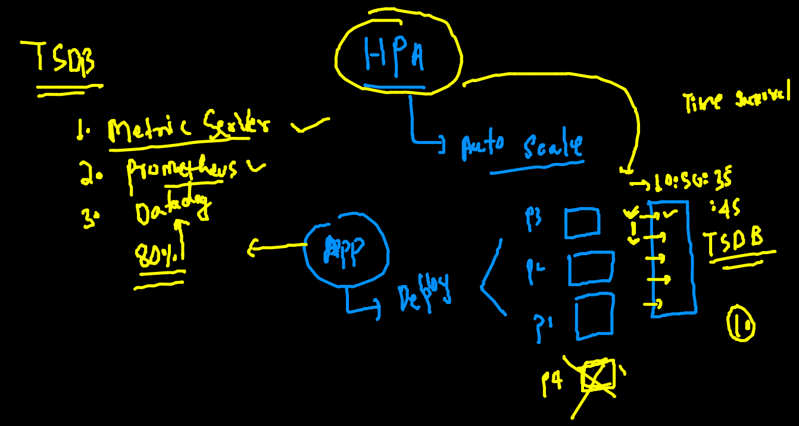
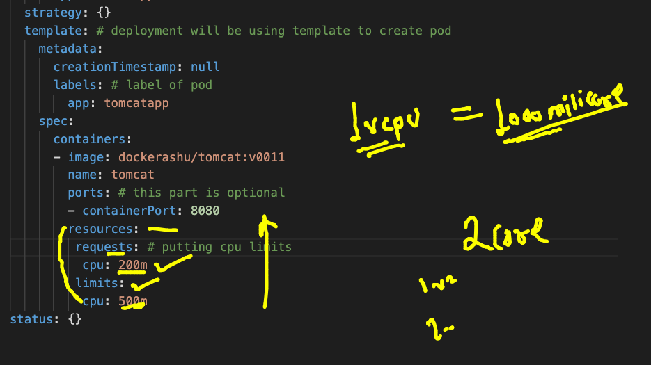

# final day 

### building image from github URL 

```
 docker  build -t dockerashu/tomcat:v0011  https://github.com/redashu/javawebapp.git
 
 ```
 
 ### list of api resources 
 
 ```
 kubectl api-resources 
NAME                              SHORTNAMES   APIVERSION                             NAMESPACED   KIND
bindings                                       v1                                     true         Binding
componentstatuses                 cs           v1                                     false        ComponentStatus
configmaps                        cm           v1                                     true         ConfigMap
endpoints                         ep           v1                                     true         Endpoints
events                            ev           v1                                     true         Event
limitranges                       limits       v1                                     true         LimitRange
namespaces                        ns           v1                                     false        Namespace
nodes                             no           v

```

### Deployment again 



### deploy the deployment in current namespace 

```
kubectl config get-contexts 
CURRENT   NAME                          CLUSTER      AUTHINFO           NAMESPACE
*         kubernetes-admin@kubernetes   kubernetes   kubernetes-admin   ashu-space

```

### creating deployment 

```
 kubectl apply -f  tomcat.yaml 
deployment.apps/tomcatapp created
 fire@ashutoshhs-MacBook-Air  ~/Desktop/k8s_apps  kubectl  get deploy
NAME        READY   UP-TO-DATE   AVAILABLE   AGE
tomcatapp   1/1     1            1           18s
 fire@ashutoshhs-MacBook-Air  ~/Desktop/k8s_apps  kubectl  get  rs   
NAME                   DESIRED   CURRENT   READY   AGE
tomcatapp-7bd98b85d6   1         1         1       25s
 fire@ashutoshhs-MacBook-Air  ~/Desktop/k8s_apps  kubectl  get  po
NAME                         READY   STATUS    RESTARTS   AGE
tomcatapp-7bd98b85d6-q2szv   1/1     Running   0          32s

```

### creating svc 

```
kubectl expose deployment tomcatapp --type LoadBalancer   --port 8080 --name  ashusvc1 --dry-run=client  -o yaml 
 6559  kubectl expose deployment tomcatapp --type LoadBalancer   --port 8080 --name  ashusvc1
 
```
 
### checking revision number in deployment 


### scaling concept of pod via  RC | RS | Deployment 



### manual horizental scaling of pod 

```
 kubectl  get deploy 
NAME        READY   UP-TO-DATE   AVAILABLE   AGE
tomcatapp   1/1     1            1           9m21s
 fire@ashutoshhs-MacBook-Air  ~/Desktop/k8s_apps  
 fire@ashutoshhs-MacBook-Air  ~/Desktop/k8s_apps  kubectl scale deployment tomcatapp --replicas=3
deployment.apps/tomcatapp scaled
 fire@ashutoshhs-MacBook-Air  ~/Desktop/k8s_apps  
 fire@ashutoshhs-MacBook-Air  ~/Desktop/k8s_apps  kubectl  get deploy                            
NAME        READY   UP-TO-DATE   AVAILABLE   AGE
tomcatapp   3/3     3            3           15m
 fire@ashutoshhs-MacBook-Air  ~/Desktop/k8s_apps  kubectl  get po -o wide
NAME                         READY   STATUS    RESTARTS   AGE   IP               NODE    NOMINATED NODE   READINESS GATES
tomcatapp-7bd98b85d6-4b49t   1/1     Running   0          12s   192.168.104.63   node2   <none>           <none>
tomcatapp-7bd98b85d6-m6rkn   1/1     Running   0          12s   192.168.104.51   node2   <none>           <none>
tomcatapp-7bd98b85d6-q2szv   1/1     Running   0          15m   192.168.104.48   node2   <none> 

```

### updating new image to deployment 

```
kubectl  set  image  deployment tomcatapp              tomcat=dockerashu/tomcat:v0022 

```

### checking revision number 

```
 kubectl describe deploy  tomcatapp         Name:                   tomcatapp
Namespace:              ashu-space
CreationTimestamp:      Fri, 12 Nov 2021 10:13:04 +0530
Labels:                 app=tomcatapp
Annotations:            deployment.kubernetes.io/revision: 2
Selector:               app=tomcatapp
Replicas:               3 desired | 3 updated | 3 total | 3 available | 0 unavailable
StrategyType:           RollingUpdate
MinReadySeconds:        0
RollingUpdateStrategy:  25% max unavailable, 25% max surge
Pod Template:
  Labels:  app=tomcatapp
  Containers:
   tomcat:
    Image:        dockerashu/tomcat:v0022
    
```

### rolling back to prevision version 

```

 fire@ashutoshhs-MacBook-Air  ~/Desktop/k8s_apps  kubectl  rollout undo  deployment  tomcatapp
deployment.apps/tomcatapp rolled back
 fire@ashutoshhs-MacBook-Air  ~/Desktop/k8s_apps  kubectl  rollout status deployment  tomcatapp 
Waiting for deployment "tomcatapp" rollout to finish: 1 out of 3 new replicas have been updated...
Waiting for deployment "tomcatapp" rollout to finish: 1 out of 3 new replicas have been updated...
Waiting for deployment "tomcatapp" rollout to finish: 1 out of 3 new replicas have been updated...
Waiting for deployment "tomcatapp" rollout to finish: 2 out of 3 new replicas have been updated...
Waiting for deployment "tomcatapp" rollout to finish: 2 out of 3 new replicas have been updated...
Waiting for deployment "tomcatapp" rollout to finish: 1 old replicas are pending termination...
Waiting for deployment "tomcatapp" rollout to finish: 1 old replicas are pending termination...
deployment "tomcatapp" successfully rolled out

```

## horizental pod autoscaler (HPA)



### putting limit in cpu 



### implementing hpa 

```
 kubectl  get  hpa
NAME        REFERENCE              TARGETS   MINPODS   MAXPODS   REPLICAS   AGE
tomcatapp   Deployment/tomcatapp   1%/80%    3         10        3          32s
 fire@ashutoshhs-MacBook-Air  ~/Desktop/k8s_apps  kubectl  get po 
NAME                         READY   STATUS    RESTARTS   AGE
tomcatapp-66566c6976-kbbds   1/1     Running   0          2m15s
tomcatapp-66566c6976-sn7p2   1/1     Running   0          27s
tomcatapp-66566c6976-vhztr   1/1     Running   0          27s
 fire@ashutoshhs-MacBook-Air  ~/Desktop/k8s_apps  kubectl  get  hpa
NAME        REFERENCE              TARGETS   MINPODS   MAXPODS   REPLICAS   AGE
tomcatapp   Deployment/tomcatapp   1%/80%    3         10        3          51s
```


