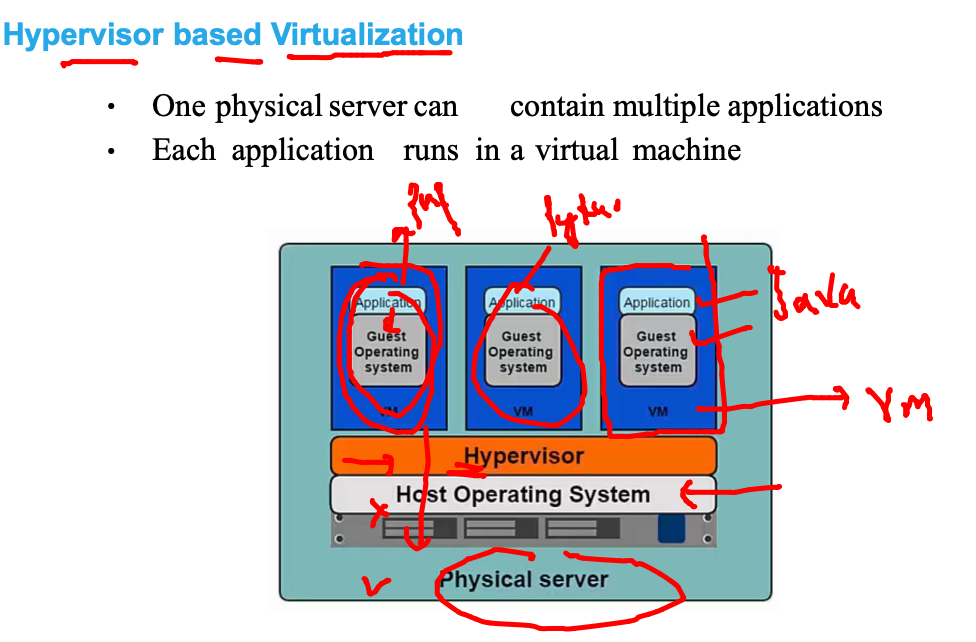

# Plan 


## app deployment in the past 


### multi apps can have prob 


### use of virtualization 



### vm is having problem because it need Entire OS 


### OS components 


### Intro to COntainers 


### vm vs containers 


### Docker only have windows and linux type containers


### Docker Installation 


### using docker Desktop 

### Docker installation locally 


## Installing docker CE in SErvers 

[Docker Install](https://docs.docker.com/engine/install/)

### Installing Docker ce in amazon Linux 

```
[root@ip-172-31-17-159 ~]# history 
    1  yum update -y
    2  yum  install docker  -y
    3  history 
[root@ip-172-31-17-159 ~]# 
[root@ip-172-31-17-159 ~]# 
[root@ip-172-31-17-159 ~]# 
[root@ip-172-31-17-159 ~]# systemctl start  docker 
[root@ip-172-31-17-159 ~]# systemctl enable  docker 
Created symlink from /etc/systemd/system/multi-user.target.wants/docker.service to /usr/lib/systemd/system/docker.service.
[root@ip-172-31-17-159 ~]# 

```

### TO connect docker we can use docker connections 


### Connecting checking from ssh to docker engine 

```
 fire@ashutoshhs-MacBook-Air  ~  ssh  ashu@34.235.28.14  
The authenticity of host '34.235.28.14 (34.235.28.14)' can't be established.
ECDSA key fingerprint is SHA256:6vjWxjcdCNyjltP0KKQcAEI+13ZjZ5lTi18+p1JmVtw.
Are you sure you want to continue connecting (yes/no/[fingerprint])? yes
Warning: Permanently added '34.235.28.14' (ECDSA) to the list of known hosts.
ashu@34.235.28.14's password: 

       __|  __|_  )
       _|  (     /   Amazon Linux 2 AMI
      ___|\___|___|

https://aws.amazon.com/amazon-linux-2/
-bash: warning: setlocale: LC_CTYPE: cannot change locale (UTF-8): No such file or directory
[ashu@ip-172-31-17-159 ~]$ 
[ashu@ip-172-31-17-159 ~]$ 
[ashu@ip-172-31-17-159 ~]$ docker  version 
Client:
 Version:           20.10.7
 API version:       1.41
 Go version:        go1.15.14
 Git commit:        f0df350
 Built:             Tue Sep 28 19:55:50 2021
 OS/Arch:           linux/amd64
 Context:           default
 Experimental:      true

Server:
 Engine:
  Version:          20.10.7


```

## Using Vscode to connectin Docker remotely 


## link to Download vscode 

[vscode](https://code.visualstudio.com/download)

### Docker COmponents 


### Docker images to create containers 


## Intro docker HUb 


## Docker basic Operations 


### Searching image from docker cli 

```
 docker  search  python 
NAME                             DESCRIPTION                                     STARS     OFFICIAL   AUTOMATED
python                           Python is an interpreted, interactive, objec…   6691      [OK]       
pypy                             PyPy is a fast, compliant alternative implem…   294       [OK]       
kaggle/python                    Docker image for Python scripts run on Kaggle   157                  [OK]
nikolaik/python-nodejs           Python with Node.js                             86                   [OK]
arm32v7/python                   Python is an interpreted, interactive, objec…   59                   
joyzoursky/python-chromedriver   Python with Chromedriver, for running automa…   59                   [OK]
centos/python-35-centos7         Platform for building and running Python 3.5…   39                   
hylang                           Hy is a Lisp 

```

```


