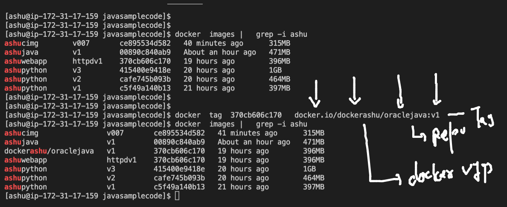

## Docker Engine storage location on Host system 


### Namespaces 


### Java based Dockerfile  


### checking default openjdk image 

```
 docker run -it --rm  openjdk  bash 
bash-4.4# java -version 
openjdk version "17.0.1" 2021-10-19
OpenJDK Runtime Environment (build 17.0.1+12-39)
OpenJDK 64-Bit Server VM (build 17.0.1+12-39, mixed mode, sharing)
bash-4.4# cat  /etc/os-release 
NAME="Oracle Linux Server"
VERSION="8.4"
ID="ol"
ID_LIKE="fedora"
VARIANT="Server"
VARIANT_ID="server"
VERSION_ID="8.4"
PLATFORM_ID="platform:el8"
PRETTY_NAME="Oracle Linux Server 8.4"
ANSI_COLOR="0;31"
CPE_NAME="cpe:/o:oracle:linux:8:4:server"
HOME_URL="https://linux.oracle.com/"
BUG_REPORT_URL="https://bugzilla.oracle.com/"

ORACLE_BUGZILLA_PRODUCT="Oracle Linux 8"
ORACLE_BUGZILLA_PRODUCT_VERSION=8.4
ORACLE_SUPPORT_PRODUCT="Oracle Linux"
ORACLE_SUPPORT_PRODUCT_VERSION=8.4
bash-4.4# jps
26 Jps

```

### Dockerfile for sample java code 

```
FROM openjdk 
# standard java based docker image from docker hub
LABEL email=ashutoshh@linux.com 
RUN mkdir /code 
COPY hello.java /code/hello.java 
WORKDIR /code 
# changing folder during image build time 
RUN javac  hello.java 
# javac is compiler -- to compile java program 
CMD ["java","myclass"]
# default parent process for this image 

```

### build image 

```
 ls
Dockerfile  hello.java
[ashu@ip-172-31-17-159 javasamplecode]$ docker build -t  ashujava:v1  . 
Sending build context to Docker daemon  3.072kB
Step 1/7 : FROM openjdk
 ---> deaa5a1a5f98
Step 2/7 : LABEL email=ashutoshh@linux.com
 ---> Running in f3319bd7976d
Removing intermediate container f3319bd7976d
 ---> 5295f8402d74
Step 3/7 : RUN mkdir /code
 ---> Running in fc557c1fc292
Removing intermediate container fc557c1fc292
 ---> 8debeeaafda2
Step 4/7 : COPY hello.java /code/hello.java
 ---> c07775e3a856
 
 ```
 
 ### creating container 
 
 ```
  docker run -itd --name  ashujc1  ashujava:v1 
d5437caf8dad6b60e48d2f91271d80969147d1d9081c6622551dc4116691e157
[ashu@ip-172-31-17-159 javasamplecode]$ docker  ps
CONTAINER ID   IMAGE         COMMAND          CREATED         STATUS         PORTS     NAMES
d5437caf8dad   ashujava:v1   "java myclass"   4 seconds ago   Up 2 seconds             ashujc1
8192541d7678   rajujava      "java myclass"   5 seconds ago   Up 4 seconds             rajujavac1
[ashu@ip-172-31-17-159 javasamplecode]$ 

```

### Image sharing concept 


### Docker hub image storage format 


## Puhsing image to docker hub 

#### create repo in docker hub and tag that image 



### login to docker hub from CLient machine 

```
 docker  login  docker.io 
Login with your Docker ID to push and pull images from Docker Hub. If you don't have a Docker ID, head over to https://hub.docker.com to create one.
Username: dockerashu
Password: 
WARNING! Your password will be stored unencrypted in /home/ashu/.docker/config.json.
Configure a credential helper to remove this warning. See
https://docs.docker.com/engine/reference/commandline/login/#credentials-store

Login Succeeded

```

### pushing image and logout 

```
docker  push  docker.io/dockerashu/oraclejava:v1
docker  logout 
Removing login credentials for https://index.docker.io/v1/

```


## Docker networking setup 


### Testing docker networking 

### create sample container 

```
docker  run -itd --name ashuc1  alpine  ping localhost 
c561534f4b080eccdc3e1d47db27004b31be57d4f578481b3e9ba3d3339df5f0
[ashu@ip-172-31-17-159 oracledockerimages]$ 
[ashu@ip-172-31-17-159 oracledockerimages]$ docker ps
CONTAINER ID   IMAGE     COMMAND            CREATED         STATUS         PORTS     NAMES
c561534f4b08   alpine    "ping localhost"   5 seconds ago   Up 3 seconds             ashuc1

```

### docker container inspection 

```
 docker  inspect  ashuc1  --format='{{.Id}}'
c561534f4b080eccdc3e1d47db27004b31be57d4f578481b3e9ba3d3339df5f0
[ashu@ip-172-31-17-159 oracledockerimages]$ docker  inspect  ashuc1  --format='{{.State.Status}}'
running
[ashu@ip-172-31-17-159 oracledockerimages]$ docker  inspect  ashuc1  --format='{{.NetworkSettings.IPAddress}}'
172.17.0.2
[ashu@ip-172-31-17-159 oracledockerimages]$ docker  ps
CONTAINER ID   IMAGE            COMMAND                  CREATED         STATUS         PORTS     NAMES
65afb103e592   vidhipython:v1   "python3 /mycode/vid…"   4 minutes ago   Up 4 minutes             vidhipythonc1
d96ef6666b47   alpine           "ping localhost"         4 minutes ago   Up 4 minutes             anithac1
4e2c3561ab7f   alpine           "ping localhost"         4 minutes ago   Up 4 minutes             dhanuc2
a5f8401c6553   alpine           "ping localhost"         4 minutes ago   Up 4 minutes             advc1
ac66873d9f16   alpine           "ping localhost"         4 minutes ago   Up 4 minutes             abhishc1
d2e5547afb53   alpine           "ping yahoo.com"         4 minutes ago   Up 4 minutes             amitdocnetc1
aea82b5ee777   alpine           "ping localhost"         5 minutes ago   Up 5 minutes             vijc1
96b05a6f2130   alpine           "ping google.com"        5 minutes ago   Up 5 minutes             rajuc1
cb6b55c23f99   alpine           "ping localhost"         5 minutes ago   Up 5 minutes             anushac1
c561534f4b08   alpine           "ping localhost"         5 minutes ago   Up 5 minutes             ashuc1
[ashu@ip-172-31-17-159 oracledockerimages]$ docker  inspect dhanuc2  --format='{{.NetworkSettings.IPAddress}}'
172.17.0.9

```

### COntainer restarting may get diff IP address 

```
[ashu@ip-172-31-17-159 oracledockerimages]$ docker  stop  ashuc1
ashuc1
[ashu@ip-172-31-17-159 oracledockerimages]$ docker  inspect  ashuc1  --format='{{.NetworkSettings.IPAddress}}'

[ashu@ip-172-31-17-159 oracledockerimages]$ docker  start  ashuc1
ashuc1
[ashu@ip-172-31-17-159 oracledockerimages]$ docker  inspect  ashuc1  --format='{{.NetworkSettings.IPAddress}}'
172.17.0.2

```

### method 2 to get IP address of containers 

```
 docker  exec -it  ashuc1  sh 
/ # 
/ # ifconfig 
eth0      Link encap:Ethernet  HWaddr 02:42:AC:11:00:02  
          inet addr:172.17.0.2  Bcast:172.17.255.255  Mask:255.255.0.0
          UP BROADCAST RUNNING MULTICAST  MTU:1500  Metric:1
          RX packets:10 errors:0 dropped:0 overruns:0 frame:0
          TX packets:0 errors:0 dropped:0 overruns:0 carrier:0
          collisions:0 txqueuelen:0 
          RX bytes:752 (752.0 B)  TX bytes:0 (0.0 B)

lo        Link encap:Local Loopback  
          inet addr:127.0.0.1  Mask:255.0.0.0
          UP LOOPBACK RUNNING  MTU:65536  Metric:1
          RX packets:174 errors:0 dropped:0 overruns:0 frame:0
          TX packets:174 errors:0 dropped:0 overruns:0 carrier:0
          collisions:0 txqueuelen:1000 
          RX bytes:14616 (14.2 KiB)  TX bytes:14616 (14.2 KiB)

/ # exit

```

### checking docker networking device 

```
[ashu@ip-172-31-17-159 oracledockerimages]$ docker  network   ls
NETWORK ID     NAME      DRIVER    SCOPE
d46b64d47296   bridge    bridge    local
cb545fe003a5   host      host      local
331a1f83334b   none      null      local

```

### connection of containers networking 

#### container 2 container 

```
 docker  ps
CONTAINER ID   IMAGE            COMMAND                  CREATED          STATUS          PORTS     NAMES
65afb103e592   vidhipython:v1   "python3 /mycode/vid…"   15 minutes ago   Up 8 minutes              vidhipythonc1
d96ef6666b47   alpine           "ping localhost"         15 minutes ago   Up 15 minutes             anithac1
4e2c3561ab7f   alpine           "ping localhost"         15 minutes ago   Up 15 minutes             dhanuc2
a5f8401c6553   alpine           "ping localhost"         15 minutes ago   Up 15 minutes             advc1
ac66873d9f16   alpine           "ping localhost"         16 minutes ago   Up 8 minutes              abhishc1
d2e5547afb53   alpine           "ping yahoo.com"         16 minutes ago   Up 8 minutes              amitdocnetc1
aea82b5ee777   alpine           "ping localhost"         16 minutes ago   Up 16 minutes             vijc1
96b05a6f2130   alpine           "ping google.com"        16 minutes ago   Up 16 minutes             rajuc1
cb6b55c23f99   alpine           "ping localhost"         16 minutes ago   Up 9 minutes              anushac1
c561534f4b08   alpine           "ping localhost"         17 minutes ago   Up 9 minutes              ashuc1
[ashu@ip-172-31-17-159 oracledockerimages]$ docker  inspect  ashuc1  --format='{{.NetworkSettings.IPAddress}}'
172.17.0.2
[ashu@ip-172-31-17-159 oracledockerimages]$ docker  inspect  vidhipythonc1  --format='{{.NetworkSettings.IPAddress}}'
172.17.0.11
[ashu@ip-172-31-17-159 oracledockerimages]$ docker  exec -it ashuc1  sh 
/ # ping 172.17.0.11
PING 172.17.0.11 (172.17.0.11): 56 data bytes
64 bytes from 172.17.0.11: seq=0 ttl=255 time=0.165 ms
64 bytes from 172.17.0.11: seq=1 ttl=255 time=0.177 ms
64 bytes from 172.17.0.11: seq=2 ttl=255 time=0.090 ms
^C
--- 172.17.0.11 ping statistics ---
3 packets transmitted, 3 packets received, 0% packet loss
round-trip min/avg/max = 0.090/0.144/0.177 ms
/ # exit

```

### Container to external world communication 


```

[ashu@ip-172-31-17-159 oracledockerimages]$ docker  exec -it ashuc1  sh 
/ # 
/ # ping google.com
PING google.com (142.250.188.206): 56 data bytes
64 bytes from 142.250.188.206: seq=0 ttl=108 time=1.107 ms
64 bytes from 142.250.188.206: seq=1 ttl=108 time=1.126 ms
64 bytes from 142.250.188.206: seq=2 ttl=108 time=1.066 ms
64 bytes from 142.250.188.206: seq=3 ttl=108 time=1.053 ms
^C
--- google.com ping statistics ---
4 packets transmitted, 4 packets received, 0% packet loss
round-trip min/avg/max = 1.053/1.088/1.126 ms
/ # exit

```

### container app can be accessed from outside using 
#### port forwarding 


### port forwarding 

```
$ docker  run -itd --name ashuweb  -p  1024:80   370cb606c170  
0b37bfd9c183ef7cfb8184e180124715f1a0483218e685cca309aa9097d8a8c5
[ashu@ip-172-31-17-159 oracledockerimages]$ docker  ps
CONTAINER ID   IMAGE           COMMAND                  CREATED          STATUS          PORTS                                   NAMES
0b37bfd9c183   370cb606c170    "/bin/sh -c 'httpd -…"   4 seconds ago    Up 2 seconds    0.0.0.0:1024->80/tcp, :::1024->80/tcp   ashuweb
ae6a467f1f74   rajuwebapp:v1   "/bin/sh -c 'httpd -…"   27 seconds ago   Up 25 seconds   0.0.0.0:5555->80/tcp, :::5555->80/tcp   rajuwebc1
[ashu@ip-172-31-17-159 oracledockerimages]$ docker  ps
CONTAINER ID   IMAGE           COMMAND                  CREATED              STATUS              PORTS                                   NAMES
b9d945699957   b045d56761a5    "/bin/sh -c 'httpd -…"   4 seconds ago        Up 3 seconds        0.0.0.0:1239->80/tcp, :::1239->80/tcp   vijweb1
d6652513024e   113982226bcb    "/bin/sh -c 'httpd -…"   9 seconds ago        Up 8 seconds        0.0.0.0:2222->80/tcp, :::2222->80/tcp   anushaweb
13f8282239f9   cc5406c221a7    "/bin/sh -c 'httpd -…"   55 seconds ago       Up 55 seconds       0.0.0.0:1010->80/tcp, :::1010->80/tcp   pavaniweb
0b37bfd9c183   370cb606c170    "/bin/sh -c 'httpd -…"   About a m

```

### Docker networking custom bridges 


### creating custom bridge 

```
docker  network  create  ashubr1 
c0356dde05b5a32820f6a956a518a51168d1a762700a1bec94b613b3874f86ef
[ashu@ip-172-31-17-159 oracledockerimages]$ docker  network  ls
NETWORK ID     NAME      DRIVER    SCOPE
c0356dde05b5   ashubr1   bridge    local
d46b64d47296   bridge    bridge    local

```


### same bridge container communication 

```
 docker  run -itd --name ashuc11 --network  ashubr1  alpine ping localhost 
6f89db374d4883e335f30eb6d351f47cf2811f803c53fc5a1025432251e92304
[ashu@ip-172-31-17-159 oracledockerimages]$ 
[ashu@ip-172-31-17-159 oracledockerimages]$ 
[ashu@ip-172-31-17-159 oracledockerimages]$ docker  run -itd --name ashuc22 --network  ashubr1  alpine ping localhost 
c9e30565f9599b4d5d7276f2cd8bfa926173a710080f7ed084087437237427b5
[ashu@ip-172-31-17-159 oracledockerimages]$ docker  exec -it ashuc11 sh 
/ # ping  ashuc22
PING ashuc22 (172.18.0.3): 56 data bytes
64 bytes from 172.18.0.3: seq=0 ttl=255 time=0.132 ms
64 bytes from 172.18.0.3: seq=1 ttl=255 time=0.130 ms
64 bytes from 172.18.0.3: seq=2 ttl=255 time=0.106 ms
^C
--- ashuc22 ping statistics ---
3 packets transmitted, 3 packets received, 0% packet loss
round-trip min/avg/max = 0.106/0.122/0.132 ms
/ # exit

```

### Custom subnet with docker networking 

```
docker  network  create  ashubr2  --subnet  192.168.1.0/24 
585c6e3344fbce01956a50c287513fb5d91d61943a2b76d72f5f2192575b611d
[ashu@ip-172-31-17-159 oracledockerimages]$ docker  run -itd --name ashuc33  --network  ashubr2 alpine 
95f9357485ebced28919fb299617acc8edb101a8d4c98425891e73d1369c43bc
[ashu@ip-172-31-17-159 oracledockerimages]$ 
[ashu@ip-172-31-17-159 oracledockerimages]$ 
[ashu@ip-172-31-17-159 oracledockerimages]$ docker  run -itd --name ashuc44  --network  ashubr2 --ip   192.1681.1.100  alpine 
docker: Error response from daemon: invalid IPv4 address: 192.1681.1.100.
See 'docker run --help'.
[ashu@ip-172-31-17-159 oracledockerimages]$ docker  run -itd --name ashuc44  --network  ashubr2 --ip   192.168.1.100  alpine 
89cace97ff394b2f9149877b47f5bb6e97ea28aefcf537286e7c1757b838c18f
[ashu@ip-172-31-17-159 oracledockerimages]$ docker  exec  -it  ashuc33 sh 
/ # ping  ashuc44
PING ashuc44 (192.168.1.100): 56 data bytes
64 bytes from 192.168.1.100: seq=0 ttl=255 time=0.106 ms
64 bytes from 192.168.1.100: seq=1 ttl=255 time=0.088 ms
64 bytes from 192.168.1.100: seq=2 ttl=255 time=0.076 ms
64 bytes from 192.168.1.100: seq=3 ttl=255 time=0.085 ms
64 bytes from 192.168.1.100: seq=4 ttl=255 time=0.082 ms
^C
--- ashuc44 ping statistics ---
5 packets transmitted, 5 packets received, 0% packet loss
round-trip min/avg/max = 0.076/0.087/0.106 ms
/ # exit
[ashu@ip-172-31-17-159 oracledockerimages]$ 

```

### remove all the networking 

```

[ashu@ip-172-31-17-159 oracledockerimages]$ docker  network prune 
WARNING! This will remove all custom networks not used by at least one container.
Are you sure you want to continue? [y/N] y
Deleted Networks:
rajubr1
anithabr1
advbr1
anushab1
ashubr2

```
### Multi stage dockerfile demo 


### dockerfile 

```
FROM oraclelinux:8.4  as Stage1 
LABEL email=ashutoshh@linux.com 
RUN yum  install java-1.8.0-openjdk.x86_64 java-1.8.0-openjdk-devel.x86_64 -y 
RUN yum  install maven -y 
RUN mkdir /javawebapp 
COPY .  /javawebapp/
WORKDIR /javawebapp
RUN mvn clean package 
# this step is to build java webapp -- to war file 
#  target/WebApp.war file will be created 

FROM tomcat 
LABEL name=ashutoshh
LABEL email=ashutoshh@linux.com 
COPY --from=Stage1 /javawebapp/target/WebApp.war /usr/local/tomcat/webapps/
EXPOSE 8080 
# Note: if cmd or entrypoint is not defined then FROM image parent process will be considered

```

### .dockerignore file 

```
Dockerfile
.dockerignore
*.old
*.sh
*.md
.git

```

### building image 

```
docker  build  -t  ashujavaapp:v001    . 
Sending build context to Docker daemon  14.85kB
Step 1/13 : FROM oraclelinux:8.4  as Stage1
 ---> 97e22ab49eea
Step 2/13 : LABEL email=ashutoshh@linux.com
 ---> Using cache
 ---> 9e9c0505f6e8
Step 3/13 : RUN yum  install java-1.8.0-openjdk.x86_64 java-1.8.0-openjdk-devel.x86_64 -y
 ---> Running in b5e23641ce76
Oracle Linux 8 BaseOS Latest (x86_64)           150 MB/s |  37 MB     00:00    
Oracle Linux 8 Application Stream (x86_64)       71 MB/s |  27 MB     00:00    
Last metadata expiration check: 0:00:08 ago on Tue Nov  9 09:59:12 2021.
Dependencies resolved.
================================================================================================
 Package                       Arch    Version                          Repository          Size
================================================================================================
Installing:
 java-1.8.0-openjdk            x86_64  1:1.8.0.312.b07-1.el8_4          ol8_appstream      337 k
 java-1.8.0-openjdk-devel      x86_64  1:1.8.0.312.b
```
### creating container 

```
docker run -itd --name  ashucj1  -p 2211:8080  ashujavaapp:v001

```

### Image pushing to OCR 

```
 docker  tag   ashujavaapp:v001   phx.ocir.io/axmbtg8judkl/javawebapp:v1   
[ashu@ip-172-31-17-159 webapp]$ 
[ashu@ip-172-31-17-159 webapp]$ 
[ashu@ip-172-31-17-159 webapp]$ docker login  phx.ocir.io  
Username: axmbtg8judkl/learntechbyme@gmail.com
Password: 
WARNING! Your password will be stored unencrypted in /home/ashu/.docker/config.json.
Configure a credential helper to remove this warning. See
https://docs.docker.com/engine/reference/commandline/login/#credentials-store

Login Succeeded
[ashu@ip-172-31-17-159 webapp]$ 
[ashu@ip-172-31-17-159 webapp]$ docker  push  phx.ocir.io/axmbtg8judkl/javawebapp:v1 
The push refers to repository [phx.ocir.io/axmbtg8judkl/javawebapp]
8f541a2b0ee6: Pushed 
450346f29d28: Pushed 
5122793ce9cb: Pushed 
cb80689c9aef: Pushed 
78700b6b35d0: Pushed 
62a5b8741e83: Pushed 
36e0782f1159: Pushed 
ba6e5ff31f23: Pushed 
9f9f651e9303: Pushed 
0b3c02b5d746: Pushed 
62a747bf1719: Pushed 
v1: digest: sha256:85e3f00e258e32efbc7f33a0e0385d23102eb303181326b614d0214fa9a5c4a8 size: 2630
[ashu@ip-172-31-17-159 webapp]$ docker logout  phx.ocir.io 
Removing login credentials for phx.ocir.io

```

### to PUll any private registry image 

```
 docker  login  phx.ocir.io  -u  axmbtg8judkl/learntechbyme@gmail.com     
Password: 
Login Succeeded
 fire@ashutoshhs-MacBook-Air  ~  
 fire@ashutoshhs-MacBook-Air  ~  
 fire@ashutoshhs-MacBook-Air  ~  docker  pull  phx.ocir.io/axmbtg8judkl/javawebapp:v1                 
v1: Pulling from axmbtg8judkl/javawebapp
bb7d5a84853b: Downloading [=>                                                 ]  2.124MB/54.92MB
f02b617c6a8c: Downloading [=======================>                           ]  2.468MB/5.153MB
d32e17419b7e: Downloading [=============>                                     ]  2.984MB/10.87MB
c9d2d81226a4: Waiting 
fab4960f9cd2: Waiting 
da1c1e7baf6d: Waiting 
1d2ade66c57e: Waiting 

```

## Docker Storage concept 

### Storage 


### COnfigure Docker engine storage 

```
[root@ip-172-31-17-159 sysconfig]# pwd
/etc/sysconfig
[root@ip-172-31-17-159 sysconfig]# ls
acpid       clock     docker          irqbalance  netconsole       raid-check     rpc-rquotad  selinux
atd         console   docker-storage  keyboard    network          rdisc          rsyncd       sshd
authconfig  cpupower  i18n            man-db      network-scripts  readonly-root  rsyslog      sysstat
chronyd     crond     init            modules     nfs              rpcbind        run-parts    sysstat.ioconf
[root@ip-172-31-17-159 sysconfig]# cat  docker
# The max number of open files for the daemon itself, and all
# running containers.  The default value of 1048576 mirrors the value
# used by the systemd service unit.
DAEMON_MAXFILES=1048576

# Additional startup options for the Docker daemon, for example:
# OPTIONS="--ip-forward=true --iptables=true"
# By default we limit the number of open files per container
OPTIONS="--default-ulimit nofile=32768:65536 -g  /oracleDE"

# How many seconds the sysvinit script waits for the pidfile to appear
# when starting the daemon.
DAEMON_PIDFILE_TIMEOUT=10
[root@ip-172-31-17-159 sysconfig]# systemctl daemon-reload 
[root@ip-172-31-17-159 sysconfig]# systemctl  restart  docker  
[root@ip-172-31-17-159 sysconfig]# 

```
### container engine data migration 

```
 rsync -avp /var/lib/docker/  /oracleDE/
 systemctl restart docker 

```
### COntainer are ephemral in nature 


### COntainer storage 


### docker volume 

```
$ docker  volume  ls
DRIVER    VOLUME NAME
[ashu@ip-172-31-17-159 oracledockerimages]$ docker  volume  create  ashuvol1 
ashuvol1
[ashu@ip-172-31-17-159 oracledockerimages]$ docker  volume  ls
DRIVER    VOLUME NAME
local     ashuvol1
[ashu@ip-172-31-17-159 oracledockerimages]$ docker  volume  inspect  ashuvol1 
[
    {
        "CreatedAt": "2021-11-09T11:18:08Z",
        "Driver": "local",
        "Labels": {},
        "Mountpoint": "/oracleDE/volumes/ashuvol1/_data",
        "Name": "ashuvol1",
        "Options": {},
        "Scope": "local"
    }
]
[ashu@ip-172-31-17-159 oracledockerimages]$ 

```

### creating container with storage 

```
docker  run -itd  --name  ashuvc1  -v   ashuvol1:/newdata:rw    alpine   
68bd6bc5a51a1fd1e7eecb0931162876534e5e52afbb3a4f57ace807c33fce42

[ashu@ip-172-31-17-159 oracledockerimages]$ docker  run -itd  --name  ashuvc1  -v   ashuvol1:/newdata:rw    alpine   
68bd6bc5a51a1fd1e7eecb0931162876534e5e52afbb3a4f57ace807c33fce42
[ashu@ip-172-31-17-159 oracledockerimages]$ 
[ashu@ip-172-31-17-159 oracledockerimages]$ docker  exec  -it  ashuvc1  sh 
/ # 
/ # 
/ # ls
bin      etc      lib      mnt      opt      root     sbin     sys      usr
dev      home     media    newdata  proc     run      srv      tmp      var
/ # cd  newdata
/newdata # ls
/newdata # mkdir hello mydata is here 
/newdata # ls
hello   here    is      mydata
/newdata # echo hello data  >a.txt 
sh: echho: not found
/newdata # ls
a.txt   hello   here    is      mydata
/newdata # echo hello data  >a.txt 
/newdata # ls
a.txt   hello   here    is      mydata

```

### same volume to another container 

```
[ashu@ip-172-31-17-159 oracledockerimages]$ docker  run -it  --name c2  -v  ashuvol1:/hellodata:ro   oraclelinux:8.4  bash 
[root@399969f54e3f /]# 
[root@399969f54e3f /]# 
[root@399969f54e3f /]# ls
bin  boot  dev  etc  hellodata  home  lib  lib64  media  mnt  opt  proc  root  run  sbin  srv  sys  tmp  usr  var
[root@399969f54e3f /]# cd  hellodata/
[root@399969f54e3f hellodata]# ls
a.txt  hello  here  is  mydata
[root@399969f54e3f hellodata]# exit
exit

```


